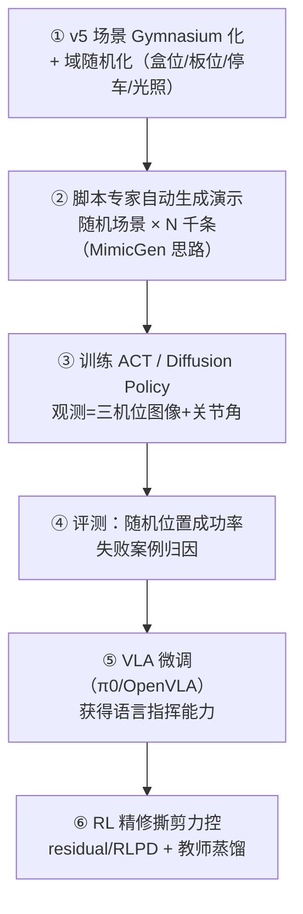

# 第二课 · 从脚本控制到学习策略：如何适应不同位置

> 我们的分药演示 v1~v5 全部是**脚本控制**：IK 解出关节目标 + 定时动作序列。
> 本课回答一个关键问题：**怎样让现实中的机器人"学"到策略，位置变了也能做对？**

## 1. 先诚实面对：我们现在的控制为什么脆弱

v5 的 `run_full_demo.py` 本质是一张**开环时间表**：

它有两个致命依赖：

1. **位姿真值**：`site_target()` 实时读 `data.body("strip").xpos`——仿真里免费，现实中根本不存在；
2. **写死的时序**：抓取 1.2 s、扭腕 3 s、松爪 0.4 s……物体稍有意外（滑了 5 mm、卡了一下），
   脚本不知道，照跳下一步。

盒 A 挪 3 cm、药板歪 10°、停车偏 5 cm——任何一件事都能让整条流水线崩掉。
**"适应不同位置"的本质，是把控制从"依赖预知的世界"改成"依赖看到的世界"。**

## 2. 三层阶梯：适应位置的三种技术路径

| 阶梯 | 方法 | 适应什么 | 局限 |
|---|---|---|---|
| ① 感知 + 脚本 | 视觉估计物体 6D 位姿，替换脚本里的真值 | 物体/停车位置变化 | 策略本身仍是死的，接触意外仍不会处理 |
| ② 模仿学习 / VLA | 端到端闭环视觉策略（图像→动作） | 位置 + 外观 + 时序意外 | 需要演示数据，数据没覆盖的情况仍会翻车 |
| ③ 强化学习 | 仿真中自我试错 + 域随机化 + sim-to-real | 接触丰富环节的力道与容错 | 奖励设计难，直接真机 RL 不现实 |

三层不是互斥的选择题，**现代系统通常是叠加**：感知打底、模仿学习当骨干、RL 精修局部。

### 阶梯 ①：最小改动——把"真值"换成"感知"

我们的脚本其实已经预留了这个接口：抓取点是从板的实时位姿算出来的、放回是按实时误差修正的。
只要接一个**位姿估计器**（如 FoundationPose、或简单的 ArUco 码/平面检测），脚本就能在
"位置变化但流程不变"的场景下工作。工业分拣大多停在这一层——够用、可解释、好调试。
**但它回答不了"撕的时候滑了怎么办"**，因为策略本身没有闭环智能。

### 阶梯 ②：模仿学习——让策略"看着办"

这是现代机器人操作的主流范式，也是 ALOHA 系列工作的核心。原理一句话：

!!! tip "闭环视觉策略为什么天然适应位置"
    策略是一个神经网络 `π(动作 | 图像, 关节角)`，**每个控制周期都重新看世界再决定动作**。
    物体在哪，不需要显式估计——位置信息隐式编码在图像里。只要训练数据里见过
    "盒子在左边 5 cm"的样子，策略就会把手伸向左边 5 cm。
    **泛化范围 = 数据的覆盖范围**，这是模仿学习的第一定律。

工作流程三步：

1. **采数据**：把任务做几十~几百遍，记录（多相机图像、关节角）→（动作）序列。
   现实中用遥操作（ALOHA 主从臂、GELLO、VR 手柄）；
2. **训练**：主流算法两个——
   **ACT**（Action Chunking Transformer，ALOHA 原生算法：一次预测未来 ~50 步动作块，
   缓解误差累积）和 **Diffusion Policy**（用扩散模型建模动作分布，擅长多模态行为）。
   训练框架推荐 Hugging Face 的 **LeRobot**（数据格式、训练、评估一条龙）；
3. **部署**：策略 30~50 Hz 闭环跑，位置变化、轻微意外都被"每步重看"吸收。

**我们有一张别人没有的好牌**：`run_full_demo.py` 在仿真里就是一个**满分专家**——
它有真值、成功率高。把场景随机化（盒 A/B 位置、板位姿、停车误差、光照纹理），
让脚本在每个随机场景里跑一遍、录下三机位图像和关节轨迹，就能**零人力自动生成
成千上万条演示**（这正是 MimicGen/DemoGen 一类工作的思路）。策略从这些数据里学到的
不是"坐标"，而是"看到盒子在哪就伸向哪"。

### 阶梯 ②+：VLA——模仿学习的"大模型版"

VLA（Vision-Language-Action）= 在互联网图文 + 大规模跨机器人数据上**预训练**的
操作大模型（π0、OpenVLA、RDT-1B、GR00T N1），再用**少量自己任务的数据微调**。
相对从零训练的 ACT，它带来两件事：

- **更强的泛化**：预训练见过海量物体与场景，位置/外观/光照的适应能力起点更高，
  微调所需演示数据从几百条降到几十条；
- **语言接口**："撕第 3 格""把药放到蓝色盒子"——任务切换不用重新训练，改指令就行。

代价是模型大（部署要好 GPU）、微调有门槛。合理顺序是**先用 ACT 把管线跑通，
再把同一批数据喂给 VLA 微调**——数据格式（LeRobot）是通用的，不浪费。

### 阶梯 ③：强化学习——演示教不会的，让它自己试

模仿学习的天花板是"演示者会的它才会"。撕剪的力道窗口、插槽卡住后的微调——
这类**接触丰富、毫米级容错**的技能，演示既难采也难覆盖所有失败恢复分支。RL 的角色：

- **在哪练**：只在仿真练（GPU 并行几千个环境，Isaac Lab / ManiSkill），
  直接真机 RL 样本效率太低且会损坏药板/机器人；
- **怎么迁移**：域随机化（动力学参数、摩擦、视觉）+ sim-to-real；
  常用**教师-学生**结构——教师用特权信息（真值位姿）训练，再蒸馏给只看图像的学生；
- **怎么和 IL 配合**（推荐，而非纯 RL）：
  模仿学习打底 → RL 在其基础上微调（**residual RL** 学修正量 /
  **RLPD** 把演示混进回放池），比从零 RL 快一个量级以上。

## 3. 我们项目的落地路线（对应路线图阶段 2~5）

每一步的"毕业标准"：

| 步骤 | 毕业标准 |
|---|---|
| ① 环境 | `env.reset()` 每次场景随机，`env.step()` 返回图像观测；脚本专家在随机场景成功率 >80% |
| ② 数据 | ≥1000 条成功演示，LeRobot 格式 |
| ③ 策略 | 位置随机 ±5 cm 内成功率 >80%（脚本在同扰动下会跌到接近 0，这就是学习的意义） |
| ⑤ VLA | 用语言指定目标格，切换任务不重训 |
| ⑥ RL | 撕剪环节对板厚/易撕线强度扰动的鲁棒性显著超过纯 IL |

## 4. 到真机还差什么

- **数据桥**：仿真练出的策略过真机，要么靠域随机化硬迁移，要么在真机补采少量遥操作
  数据微调（几十条量级）。ALOHA 平台的意义就在于遥操作采数据极其顺手；
- **停车误差**：v5 里我们假设停车零误差；闭环视觉策略天然吸收停车偏差——
  它看的是桌上的盒子，不是里程计。这正是"学习策略适应位置"最直接的收益；
- **安全兜底**：学到的策略是黑盒，真机上必须包一层安全壳——关节限位、力矩上限、
  工作空间虚拟墙、异常接触力急停。策略负责"聪明"，安全壳负责"不出事"。

## 5. 一句话总结

> **脚本 = 把世界写进代码；学习 = 把世界留在输入里。**
> 感知替换真值是第一步，模仿学习（进而 VLA）让策略每一步"看着办"，
> RL 精修接触技能；泛化不是算法赠送的，是数据覆盖买来的——
> 而我们手里的仿真脚本专家，恰好是最便宜的数据印钞机。
