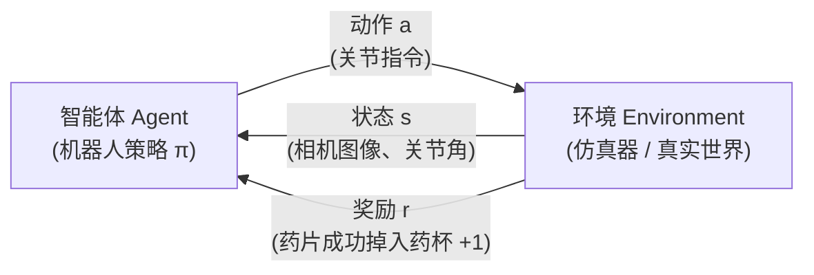
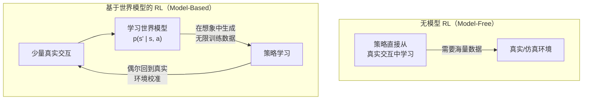
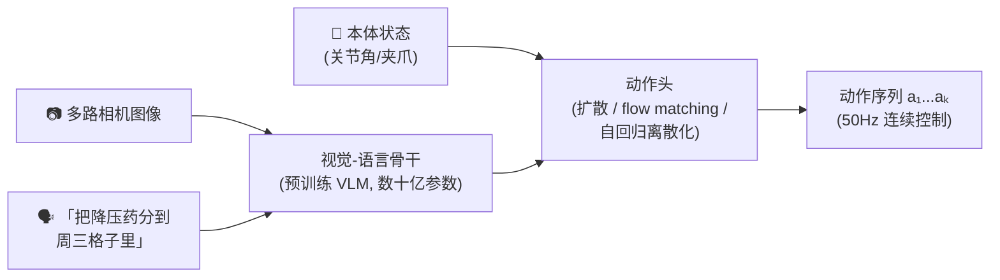

# 第一课 · 三大技术支柱总览

!!! abstract "本课目标"
    用最少的数学、最多的直觉，搞清楚三个问题：**强化学习、世界模型、VLA 各自是什么？它们如何分工？为什么我们的分药机器人三者都需要？**

## 1. 强化学习（Reinforcement Learning, RL）

### 一句话理解

> 不告诉机器人"怎么做"，只告诉它"做得好不好"（奖励），让它在千万次试错中自己悟出最优动作。

### 核心循环

每一步，策略 \( \pi(a|s) \) 根据状态选动作，目标是最大化**累积奖励** \( \mathbb{E}[\sum_t \gamma^t r_t] \)。就这么简单——难的全在工程细节里。

### 对我们项目的意义

- **接触密集型精细操作**（按压铝塑板、捏取药片）很难手写控制器，也很难纯靠模仿学到鲁棒，RL 的试错精调是关键武器。
- 现代范式往往是 **"模仿学习打底 + RL 精调"**：先用人类演示让策略"会做"，再用 RL 让它"做得又稳又好"。

### 要警惕的坑

!!! danger "RL 的三大痛点"
    1. **样本效率低**：动辄百万级交互，真机上不可行 → 必须仿真先行（以及后面的世界模型）。
    2. **奖励设计难**："分药成功"很稀疏，中间过程怎么给分是门艺术，设计不好机器人会"钻空子"（reward hacking）。
    3. **Sim-to-Real 鸿沟**：仿真里学会 ≠ 真机能用，需要域随机化（domain randomization）等技术弥合。

## 2. 世界模型（World Model）

### 一句话理解

> 让机器人在"脑内"学出一个环境模拟器：给定当前状态和动作，**预测**下一刻会发生什么。有了它，机器人可以在想象中练习和规划，不必事事真做。

### 与 RL 的关系

代表工作：**DreamerV3**（在潜空间想象中训练策略，一套超参通吃上百个任务）、**TD-MPC2**（用学到的模型做在线规划）。

### 对我们项目的意义

- **数据效率**：真机分药数据极贵，世界模型能把每条数据"榨干"。
- **安全预演**：在给老人缠血压袖带之前，机器人可以先在世界模型里"想象"这个动作的后果，预判风险——这正是安全性要求极高任务的刚需能力。
- **失败预测**：预测到"药片即将掉到桌外"就提前修正。

## 3. VLA（Vision-Language-Action 模型）

### 一句话理解

> 把大语言模型的"通识智慧"嫁接到机器人上：输入**图像**和**自然语言指令**，直接输出**机器人动作**。它是机器人界的 GPT 时刻。

### 典型架构

代表工作：Google **RT-2 / Gemini Robotics**、Physical Intelligence **π0 / π0.5**、开源的 **OpenVLA**、**RDT-1B**（双臂！）、NVIDIA **GR00T N1**。

### 对我们项目的意义

- **指令理解**："给王奶奶分今天早上的药" → 机器人能理解"王奶奶""今天早上"意味着什么。
- **泛化**：预训练见过百万种物体和场景，换个药瓶、换个房间不至于完全失灵。
- **长时序编排**：新一代 VLA（如 π0.5）能自己把大任务拆成子步骤。

### 现实检查

!!! warning "VLA 不是银弹"
    当前 VLA 的输出精度和可靠性还撑不起"毫米级按压药板"——这正是要用 RL 精调和力控来补的短板。产品级系统 = VLA 的泛化 + RL 的精度 + 世界模型的预判 + 传统控制的安全兜底。

## 4. 三者如何在我们的机器人上分工

| 层级 | 技术 | 频率 | 职责 | 分药任务中的例子 |
|---|---|---|---|---|
| 任务层 | VLA / LLM | ~1 Hz | 理解指令、拆解任务、调度技能 | "分药"→ 取药板 → 按压 → 投放 |
| 技能层 | 模仿学习 + RL 策略 | 10~50 Hz | 执行具体操作技能 | 双臂协同按压铝塑板 |
| 预判层 | 世界模型 | 伴随技能层 | 预测后果、辅助规划、失败预警 | 预测药片弹出轨迹 |
| 安全层 | 传统控制 + 硬件 | 100~1000 Hz | 力矩限制、碰撞检测、急停 | 接触力超阈值立即停止 |

!!! success "本课小结"
    - **RL**：试错学习，擅长精细接触操作，但费数据、难设计奖励。
    - **世界模型**：脑内模拟器，换来数据效率和安全预演能力。
    - **VLA**：大模型进入物理世界，带来指令理解和泛化。
    - 产品级机器人 = 四层金字塔：VLA 调度 + 技能执行 + 世界模型预判 + 传统控制兜底。

**下一课预告**：深入 RL 基础——MDP、值函数与策略梯度（配可视化小实验）。
