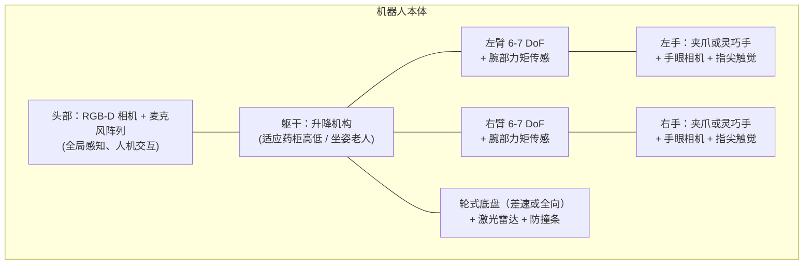

# 硬件平台 · 选型初探

!!! info "定位"
    本页是**第一版调研笔记**，记录选型的思考框架和候选清单。具体型号与价格会随调研深入持续更新（硬件市场变化很快，最终采购前需重新核价）。

## 整机形态

目标形态：**轮式底盘 + 升降躯干 + 双 6~7 DoF 机械臂 + 末端灵巧手/夹爪 + 头部相机**。

## 核心争论：三指还是五指？

这是你提出的关键问题。先给结论：

!!! success "初步建议：从「二指平行夹爪 + 特化指尖」起步，阶段 3 再对比引入三指或五指手"
    理由：分药任务需要的是**一个稳定夹持 + 一个精准按压**，前者二指夹爪即可胜任，后者甚至可以是单根"仿生拇指"压杆。自由度不是越多越好——每多一个自由度，控制、标定、数据采集、维护成本都在上升。**先用最简单的硬件打通全流程，再让任务需求牵引硬件升级。**

三类末端的系统对比：

| 维度 | 二指平行夹爪 | 三指手（~3-9 DoF） | 五指灵巧手（6-20+ DoF） |
|---|---|---|---|
| 代表产品 | Robotiq 2F、大寨 PGI | Robotiq 3F、BarrettHand | Shadow Hand、Inspire 因时、傲意、宇树 Dex 系列 |
| 分药适配度 | 夹药板 ✔ / 按压需特化指尖 | 夹持稳、可捏取小药片 | 最接近人手取药动作 |
| 量血压适配度 | 拉袖带勉强 | 抓握袖带可行 | 最适合柔性物操作 |
| 控制难度 | 低（1 DoF） | 中 | 极高 |
| 学习数据需求 | 少 | 中 | 大（且遥操作采集难） |
| 可靠性/维护 | 极高 | 高 | 中（线驱磨损、指尖易损） |
| 价格量级 | 数千~2万元 | 2~10万元 | 5~50万元 |
| 触觉传感集成 | 易（指尖贴装） | 中 | 部分产品原生集成 |

!!! note "你提到的「6 自由度五指手」"
    市面上不少"五指手"其实是 **6 主动自由度**（每指 1 DoF + 拇指侧摆），例如因时 RH56 系列。这类手是"欠驱动五指"：外形像人手、利于模仿学习的动作映射，但灵巧度介于三指和全驱动五指之间，价格也适中——很可能是我们阶段 5 的甜点选择。真正的全驱动手（Shadow 20+ DoF）研究价值大但产品化风险高。

## 候选平台盘点（2026 年视角，待核实更新）

### 一体化双臂移动平台（买整机，省集成）

| 平台 | 特点 | 顾虑 |
|---|---|---|
| 星海图 R1 / Galaxea | 轮式+双臂，面向具身智能研发，生态兼容 LeRobot 类工具链 | 价格、供货 |
| 智元 Genie / 远征系列 | 国产供应链成熟，有轮式款 | 偏人形，开放性待确认 |
| Mobile ALOHA（开源自建） | 论文同款，完整开源 BOM（~3万美元级），社区资料多 | 需自己组装调试，夹爪为二指 |
| Galaxy/AgileX 类底盘 + 双 UR/Franka 臂自集成 | 灵活可控、传感器随便加 | 集成工作量大 |

### 机械臂（若自集成）

| 型号 | DoF | 负载 | 特点 |
|---|---|---|---|
| Franka Research 3 | 7 | 3 kg | 全关节力矩传感，力控标杆，科研生态最好 |
| UR5e | 6 | 5 kg | 工业级可靠，力控接口完善 |
| 国产协作臂（遨博/节卡/珞石等） | 6-7 | 3-5 kg | 性价比高，需验证力控性能 |
| ARX / 松灵低成本臂 | 6-7 | 1-3 kg | LeRobot 社区热门，遥操作生态好，适合快速起步 |

### 关键传感器

- **头部相机**：RGB-D（如 RealSense D455 / 奥比中光），提供全局场景
- **手眼相机**：每臂腕部一个小型 RGB 相机——模仿学习的标配输入
- **指尖触觉**：GelSight 类视触觉 / 压阻阵列（Xela 等）——分药按压的关键
- **底盘**：2D 激光雷达 + IMU + 防撞条（导航与安全）
- **麦克风阵列 + 扬声器**：语音交互（老人的主要交互方式）

## 仿真优先：现在还不用花一分钱

!!! tip "阶段 0~4 完全可以零硬件成本推进"
    MuJoCo / Isaac Lab / ManiSkill 中已有大量现成的双臂 + 灵巧手模型（Shadow Hand、Allegro、ALOHA 双臂等）。我们完全可以先在仿真里把分药任务的策略打磨到高成功率，同时用这段时间完成硬件调研与预算规划。**建议真机采购决策推迟到阶段 3 结束**，届时我们会有仿真数据支撑"三指 vs 五指"的选择。

## 待办清单

- [ ] 建立候选平台价格/参数对照表（联系厂商获取当前报价）
- [ ] 调研触觉传感器供货与 SDK 开放程度
- [ ] 阶段 3 仿真对比实验：二指+压杆 vs 三指 vs 欠驱五指的分药成功率
- [x] 确认本机 GPU 配置：**RTX 4080 / 16 GB 显存** —— 满足 Isaac Lab 官方推荐配置，可本地大规模并行仿真 ✔
