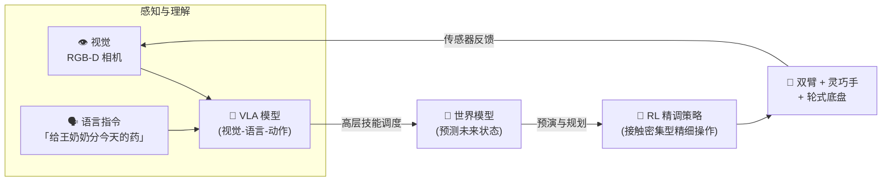

# 欢迎来到 RL4Robotics 实验室

# 🤖 让机器人照护老人

**强化学习 × 世界模型 × VLA** —— 从零开始，搭建一台能够**自动分药**、**协助测量血压**的双臂轮式移动操作机器人，并最终走向产品化。

🎯 目标驱动学习
📊 数据可视化记录
🦾 双臂 + 轮式底盘
🖐️ 三指 / 五指灵巧手
🏥 养老照护场景

## 我们要解决什么问题？

中国 60 岁以上人口已超过 3 亿，慢病老人平均每天服药 3~5 种。**分药**（尤其是从铝塑板中取药）和**测量血压**是频率最高、又最依赖人工的两项照护工作。它们对机器人提出了近乎苛刻的要求：

- :material-pill:{ .lg .middle } **毫米级灵巧性**

    ---

    药片直径 5~12 mm，铝塑板需要"一手固定、一手按压"的双手协同，按压力道差之毫厘就会压碎药片。

- :material-shield-heart:{ .lg .middle } **人身安全**

    ---

    量血压需要机器人与老人**直接物理接触**——缠绕袖带、扶持手臂。任何失控都不可接受，必须有多层安全冗余。

- :material-home-map-marker:{ .lg .middle } **非结构化环境**

    ---

    家庭和养老院不是工厂流水线：光照多变、物品随意摆放、老人行为不可预测，机器人必须"见机行事"。

- :material-infinity:{ .lg .middle } **长时序任务**

    ---

    "去药柜取药 → 认药 → 分药 → 送到老人手边"是一条包含导航、感知、操作的长链条，任何一环出错都要能发现并恢复。

## 技术路线：三大支柱

我们将用三种互补的技术来攻克上面的难题，它们的关系可以概括为一句话：

> **VLA 是"大脑皮层"（理解指令、通用技能），世界模型是"想象力"（在脑内预演未来），强化学习是"肌肉记忆训练法"（在试错中打磨精细动作）。**

三者的详细介绍见 [第一课 · 三大技术支柱总览](concepts/overview.md)。

## 当前进度

0当前阶段 / 共 7 阶段

5学习日志篇数

7完成的仿真实验

2/2+回收分药 v5 移动全流程成功

!!! success "最新进展 · 2026-07-18"
    **分药 v5 移动操作机器人达成**：机器人 = 轮式底盘 + 双臂并排朝前（Mobile ALOHA 形态），盒 A/盒 B 在固定桌上；驶离充电桩停到桌前，双臂越过桌沿完成取板、撕剪入盒 B（2/2）、剩板插回盒 A，62 秒全流程。[看移动全流程演示 →](journal/2026-07-18-mobile.md)

!!! tip "如何使用这个网站"
    - **[学习路线图](roadmap.md)**：整个项目的地图，随时回来看看我们走到哪了。
    - **[核心概念](concepts/overview.md)**：每学一个新概念，就沉淀成一篇图文并茂的笔记。
    - **[目标任务](tasks/index.md)**：分药、量血压两大任务的工程化拆解，随项目推进不断细化。
    - **[学习日志](journal/index.md)**：按日期记录实验数据、训练曲线、演示视频，是我们的"实验记录本"。
    - **[资源库](resources.md)**：论文、课程、开源代码的精选清单。
