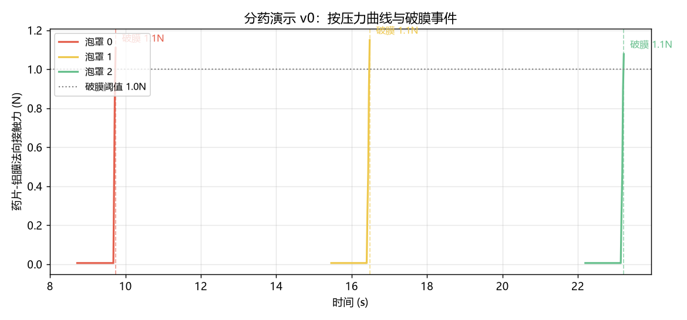

# 2026-07-10 · 启程：项目定义与知识库搭建

## 今日目标

- [x] 明确项目愿景与目标任务
- [x] 确定技术路线与学习路线图
- [x] 搭建可持续更新的学习记录网站

## 今日成果

### 1. 项目定义

确定了"北极星"任务：**双臂轮式机器人在养老场景完成自动分药与辅助测量血压**。两个任务共同点：安全性与灵巧性要求极高，是移动操作（mobile manipulation）领域的前沿难题，也因此有真实的产品价值。

### 2. 技术路线

确立"三大支柱 + 分层架构"的思路（详见[第一课](../concepts/overview.md)）：

- **VLA**：任务理解与泛化（~1 Hz 决策）
- **模仿学习 + RL**：精细操作技能（10~50 Hz）
- **世界模型**：预演、规划与数据效率
- **传统控制**：力控与安全兜底（100~1000 Hz）

### 3. 关键决策记录

| 决策 | 结论 | 理由 |
|---|---|---|
| 仿真 or 真机先行 | 仿真先行 | 真机贵且危险，仿真可无限试错 |
| 末端执行器初始选择 | 二指夹爪+特化指尖起步 | 最小复杂度打通全流程，阶段 3 用数据说话再升级 |
| 任务优先级 | 先分药后量血压 | 量血压涉及人体接触，风险和仿真难度都更高 |
| 量血压产品形态 | L1（递送提醒）→ L4（全自动）阶梯 | 风险递进，每级都可交付 |
| 文档工具 | MkDocs Material | Markdown 写作 + 中文搜索 + Mermaid 图表，纯本地可用 |

### 4. 学习者画像与资源盘点

| 项目 | 情况 | 对计划的影响 |
|---|---|---|
| 基础 | 用过 PyTorch 训练过模型，未接触 RL/机器人 | 阶段 0 跳过深度学习基础，直攻 RL 理论 + 机器人学 |
| 算力 | RTX 4080（16 GB 显存），驱动 591.86 | 可本地跑 Isaac Lab / ManiSkill GPU 并行仿真，中小模型微调可行；训练 7B 级 VLA 需云端或量化方案 |
| 时间 | 全职投入（30+ 小时/周） | 路线图整体压缩约 40%，预估 10~12 个月走完七阶段 |
| 硬件 | 暂无真机，无近期采购计划 | 阶段 0~4 纯仿真推进，阶段 3 结束后用数据支撑选型决策 |

### 5. 基础设施

- 搭建了本知识库网站（MkDocs Material，支持中文搜索、深色模式、Mermaid 流程图）
- 目录结构：`concepts/`（概念笔记）、`tasks/`（任务拆解）、`hardware/`（硬件调研）、`journal/`（本日志）
- **部署上线**：仓库推送至 [GitHub](https://github.com/anoymous-code/RL4Robotics)，GitHub Actions 自动构建并发布到 [GitHub Pages](https://anoymous-code.github.io/RL4Robotics/)。今后只要 `git push`，网站几分钟内自动更新
- 创建了 Python 3.11 虚拟环境（`.venv`），装好 Gymnasium + MuJoCo 3.10 + Stable-Baselines3 + PyTorch 2.11（CUDA 12.8 版，已验证识别 RTX 4080）

## 实验记录

### 实验 1 · 第一段 MuJoCo 仿真视频（随机策略）

跑通了 Gymnasium + MuJoCo 全流程，用**随机动作**驱动 `Walker2d-v5` 并录像（脚本：`experiments/stage0/first_sim_video.py`）：

<video controls src="../../assets/videos/stage0_random_walker.mp4" style="max-width: 480px; width: 100%; border-radius: 8px;"></video>

| 项目 | 值 | 说明 |
|---|---|---|
| 环境 | `Walker2d-v5` | 双腿行走者，MuJoCo 经典任务 |
| 观测空间 | `Box(17,)` | 关节角度、角速度、躯干高度等 |
| 动作空间 | `Box(-1, 1, (6,))` | 6 个关节的力矩指令 |
| 3 回合表现 | 10 / 19 / 23 步，累积奖励 -1.3 / 1.2 / 7.9 | 随机动作几步就摔倒——这就是"学习前"的机器人 |

这段憨态可掬的摔倒视频就是我们的**基线**：阶段 1 用 RL 训练后，同一个机器人将学会稳定行走，到时候把前后对比放在一起，就是最直观的"学习"证明。

### 实验 2 · 分药场景仿真 v0：双臂协同按压取药（3/3 成功） { #exp2-pill-demo }

**当天最大突破**：直接把[任务 A](../tasks/pill-sorting.md) 的核心环节搬进了 MuJoCo——ALOHA 双臂平台上，左臂夹持 3 格铝塑药板悬于药杯上方，右臂持按压杆逐格下压，药片破膜坠入药杯，**三粒全部成功入杯**。

<video controls src="../../assets/videos/pill_demo_v0.mp4" style="max-width: 640px; width: 100%; border-radius: 8px;"></video>

按压力曲线（每格泡罩一次干净的力脉冲，达到阈值即触发破膜）：

**场景与方法**（代码在 `experiments/pill_sorting/`）：

| 组件 | 实现 | 简化说明 |
|---|---|---|
| 机器人 | MuJoCo Menagerie 的 ALOHA 2（双 ViperX-300s） | 论文同款开源模型 |
| 药板 | 3 格泡罩：顶板开孔 + 围栏 + 底面铝膜，固连在左夹爪上 | "已抓稳"假设，跳过抓取环节 |
| 铝膜破裂 | 监控药片-铝膜法向接触力，超阈值(1 N)后关闭该格铝膜碰撞 | 真实破膜力 5~30 N，待实测标定 |
| 按压杆 | 右夹爪固连细压杆（φ10mm） | 代替指尖，v1 将换为夹爪指尖直接按压 |
| 控制 | 离线阻尼最小二乘 IK 解关键构型 + 关节空间最小加加速度插值 | 脚本化编排，非学习策略 |
| 验证 | 药片最终坐标判定入杯 + 全程力曲线记录 | - |

**迭代过程记录**（共 8 轮，每轮都靠渲染帧诊断）：

1. 初版在线微分 IK 一直压不到位——**方向误差的线性化与雅可比不一致**（用了轴角叉乘误差配 z 轴变化率雅可比），修正为统一的"z 向量差"后，IK 从 176mm 误差降到 0.1mm；
2. 左臂持板刚度太低，按压时药板被压跑，力上不去——放大左臂伺服 kp 15 倍（模拟稳定握持），并把破膜阈值从 3N 降到 1N（记录在案：这是仿真伺服柔性导致的权宜，v1 应换成更真实的力学标定）；
3. 发现一次"假成功"：铝膜没破，药片却被挤过围栏掉进杯里——**和 RL 的 reward hacking 一模一样**：验收指标（入杯）与期望行为（破膜取药）不等价。已通过加高围栏 + 破膜状态判定修复；
4. 最后一个 bug：左夹爪指尖遮挡最外侧泡罩，压杆压到了夹爪上——把药板外伸距离从 14cm 调到 19cm 解决。视觉检查（渲染关键帧）在这里救了大命。

**下一步（分药 v1 计划）**：泡罩位置/药片尺寸域随机化 → 把脚本化演示改造成 Gymnasium 环境 → 采集脚本演示数据，为阶段 2 的模仿学习做准备。

## 踩坑与解决

- **pip 安装失败**：系统代理（127.0.0.1:7890）未运行导致 `ProxyError`。解决：设置环境变量 `NO_PROXY='*'` 绕过。若后续 pip 仍失败可用同样方法。
- **Mermaid 图渲染依赖 CDN**：Material 主题默认从 unpkg 加载 mermaid.js，国内网络不稳。解决：下载 `mermaid.min.js` 到 `docs/assets/js/` 本地加载。
- **GitHub Pages 首次部署失败**：workflow 中 `configure-pages` 的 `enablement: true` 并未成功自动开启 Pages（Setup Pages 步骤报错）。解决：通过 GitHub API `POST /repos/{owner}/{repo}/pages`（`build_type: workflow`）手动开启一次后重跑工作流即成功，之后的推送不再受影响。
- **torch/mujoco 导入报 WinError 1114**（DLL 初始化失败）：排查发现根因是虚拟环境基于 Anaconda 的 Python 3.11 创建，DLL 搜索优先命中了 Anaconda 自带的**老版 VC++ 运行库**（`D:\Anaconda3\msvcp140.dll`，14.27），而新版 torch/mujoco 需要更新的运行库（系统里其实有 14.44，但被 Anaconda 的抢先了）。解决：用 winget 安装官方 Python 3.11.9，重建 `.venv`，问题消失。**经验：做机器人学习开发，虚拟环境尽量基于官方 python.org 的解释器，避开 Anaconda 的 DLL 干扰。**

## 下一步计划

1. ~~搭建 Python/PyTorch 环境~~ ✔ 已完成（官方 Python 3.11.9 + `.venv`）
2. ~~跑通第一个 Gymnasium + MuJoCo 环境并录制视频~~ ✔ 已完成（见上方实验 1）
3. 开始 RL 基础学习：MDP 与值函数（配一个网格世界可视化小实验）
4. 阶段 1 预热：用 PPO 训练 `Walker2d-v5`，与今天的随机基线做前后对比
