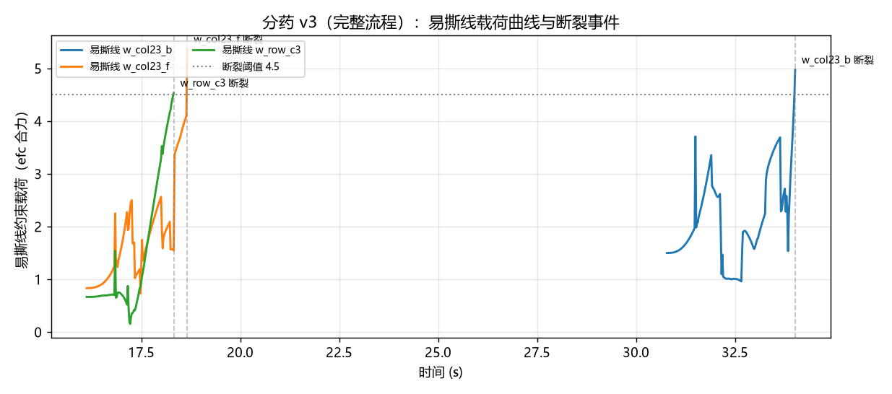

# 2026-07-17 (晚) · 分药 v3：盒 A 取板 → 撕剪 → 入盒 B → 放回盒 A 全闭环

## 今日目标

- 把撕剪任务扩展为**完整分药流程**：药板初始竖插在装有多块铝塑板的**盒 A**（插板架）中，
  左手真实抓取取出 → 双臂撕剪单格 → 单格投入**盒 B**（药片盒）→ 剩板插回盒 A 原槽位。
- 去掉 v2 最大的简化：药板不再"天生固连"在左夹爪上，而是场景中的自由体。

## 结果

**全流程一次运行 53 秒内完成：撕剪入盒 B 2/2，剩板插回盒 A 成功。**

<video controls src="../../assets/videos/pill_full_v3_multicam.mp4"></video>



流程分解（时间轴对应视频）：

| 阶段 | 时间 | 内容 |
|---|---|---|
| 1 取板 | 0~7 s | 左臂移到盒 A 上方，竖直下降跨住药板手柄（9 mm 厚），闭爪提出槽位 |
| 2 转体 | 7~12 s | 空中转体 90°：竖直的板转到水平工作位，8 格朝上、自由端指向右臂 |
| 3 撕剪 ×2 | 12~35 s | 右手夹住第 4 列前/后格外缘，扭腕撕断易撕线（阈值 4.5） |
| 4 投放 ×2 | 每次撕后 | 指尖朝下运到盒 B 上方 7.5 cm 处松爪 + 3.5 Hz 抖腕 |
| 5 放回 | 40~53 s | 左臂把剩 6 格的板转回竖直，插回盒 A 中间槽位，松爪撤离 |

## 场景建模

- **盒 A（插板架）**：木色小盒内有两块隔板分出 3 个插槽（槽宽 12 mm），中间槽插目标板，
  两侧槽插两块静态装饰板示意"一堆铝板"。药板竖立、手柄朝上露出盒沿 3 cm，是药房里
  常见的立式收纳姿态，也给了夹爪清晰的抓取空间。
- **药板 = 自由体**：手柄条（strip）+ 8 格（各自 freejoint）+ 12 条可断裂焊接约束，
  与 v2 相同；区别是整板不再固连于左夹爪，XML 初始位姿即"插在槽中竖立"
  （焊接 relpose 在 qpos0 捕捉，任何全局位姿都不影响刚性布局）。
- **盒 B（药片盒）**：18×15 cm、壁高 3 cm 的浅盒，接收撕下的单格。

## 左手抓取：从"固连"到"真抓 + 锁定"

左手对手柄的夹持要在撕剪时对抗右手的扭转反力矩（约 0.5 N·m，力臂 ~8 cm）。
纯摩擦夹持实测会滑移（首跑记录到 9 mm / 7° 滑移，且撕剪几何随之漂移）——
平行二指爪捏一个 9 mm 板条对抗弯矩，物理上确实吃亏（人手会整个握住板）。

解决：**抓稳后启用"锁定焊接"（sticky gripper）**。XML 里预定义一条 `active="false"` 的
weld（左爪 ↔ strip），闭爪确认夹持后把**当前实际相对位姿**写入 `eq_data` 的 relpose 段再置
`eq_active=1`，放板松爪前再置回 0。这是操作仿真的标准抽象（Meta-World、RLBench 同款），
等效于真机上更强夹持力/自锁指形；闭爪动作本身保留，视觉与流程完全真实。
右手撕剪与投放仍是**纯摩擦夹持**，无任何吸附。运行加 `--no-latch` 可切回纯摩擦对照。

## 踩坑与解决

1. **右爪闭合只剩 1 个接触点，格子撕断即飞**。v2 里同样的抓取参数好好的，v3 却不行。
   排查发现根因在上游：药板在槽中沉降后有 ~2.5° 倾斜，抓取锁定后这个倾斜被"记住"，
   左手按标准姿态转到工作位时**板面残留倾角**，右爪水平指腹对倾斜薄板只能单点接触。
   解决：工作位 IK 目标不再是"手摆标准姿态"，而是**按"板要水平"反解手的姿态**——
   用抓取时记录的手-板相对旋转 `R_site = R_board_target @ R_rel^T` 生成左手轴约束，
   板面倾角从 2.5° 压到 0.2°，右爪恢复 4 接触点稳定夹持。
2. **断裂瞬间弹射**。悬持板（锁定焊接 + 手臂伺服）比 v2 固连板柔性大，扭到阈值 6.0 时
   积累的弹性变形更多，断裂释放把格子弹出指间。解决：阈值降到 4.5（小变形处断裂）+
   断后停 0.5 s 让振荡衰减，再运送。
3. **运送途中掉格**。提起时不约束姿态，IK 随意选姿导致格子被甩掉。解决：提起阶段保持
   撕剪姿态只平移，运送到盒 B 的转姿放慢到 2.4 s。
4. **格子挂在指尖不落**（v2 老问题复发）：投放高度降到 7.5 cm 后 0.15 rad 抖腕甩不下来。
   解决：抖腕加强到 0.28 rad / 3.5 Hz / 1.2 s。盒 B 同步加大（18×15 cm、壁 3 cm），
   低空投放 + 大盒容错，2/2 落入。
5. **放回时插不进槽**。撕掉第 4 列后板变短 24 mm，仍按原板长下插会让板底悬在隔板顶
   之上就"到位"了，松爪后板斜靠在盒沿。解决：下插深度按**剩余板长**动态计算
   （遍历未撕格取最大 x 偏移），板底降到隔板顶以下 5 cm 处（已被槽壁约束）再松爪，
   板自行落座槽底。
6. **锁定焊接也要硬化**。默认 `solref/torquescale` 下 0.03 kg 的板悬挂会下垂几毫米、
   扭转时晃动，与易撕线同款硬化参数（`solref="0.0015 1" torquescale="20"`）后稳定。

## 学到了什么

- **上游的毫米/度级误差会在下游放大成致命失败**：板在槽里歪 2.5°，撕剪端就从 4 接触点
  变 1 接触点。长链条操作任务里"每一步把状态整理干净"（本例：把板调平）比"下游想办法
  容忍"更省力——这正是真实机器人系统里 regrasping / in-hand reorientation 的价值。
- **抓取即记录**：抓稳瞬间记录的手-物相对位姿是后续所有规划的"标定"，转工作位、放回
  插槽全部基于它反解，天然补偿抓取误差。
- 断裂类接触任务的**阈值-柔性耦合**：系统越柔，同样阈值下断裂释放的能量越大。阈值要和
  持物刚度一起调。

## 复现

```powershell
cd experiments\pill_sorting
..\..\.venv\Scripts\python.exe gen_tear_model.py   # 重新生成 aloha_tear.xml / scene_tear.xml
..\..\.venv\Scripts\python.exe run_full_demo.py    # 完整流程（三机位录像 + 载荷曲线）
```

## 明日计划

- 目标格随机化（8 格任选）+ 撕剪顺序规划（中间格需先撕邻格）
- 把全流程包装成 Gymnasium 环境，定义观测/动作/奖励，准备进入学习阶段
