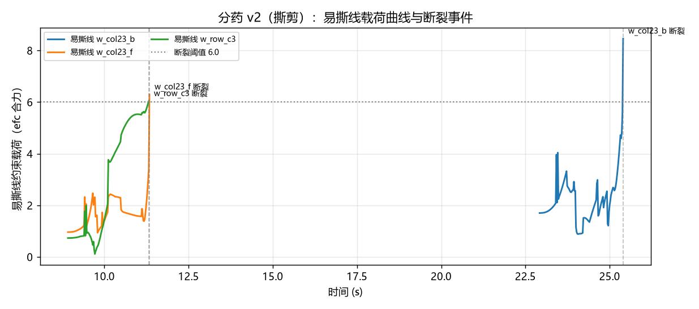

# 2026-07-17 (下) · 分药 v2：双臂撕剪单格泡罩入托盘

## 需求变更

真实的分药流程和我们 v1 的假设有个关键差别：**药房/照护场景里通常不把药片压出来**，而是沿易撕线把铝塑板剪/撕成单格，连板带药分发——药片保持密封，更卫生、更可追溯。今天把任务改成：

> 一板 **8 片**（2 行 × 4 列）的铝塑板，双手协同**撕下其中任意一格**（药片不拆封），放入下方**托盘**。

## 成果：2/2 单格撕剪入托盘

<video controls src="../../assets/videos/pill_tear_v2_multicam.mp4" style="max-width: 720px; width: 100%; border-radius: 8px;"></video>

单次运行连撕两格（第 4 列前排、后排），全部落入托盘。流程完全脚本化、无人工干预：

1. **左手持板**：夹持药板手柄端，把板水平送到工作位；
2. **右手夹缘**：从药板自由端水平接近，指尖捏住目标格外缘（真实摩擦夹持，无吸附作弊）；
3. **扭腕撕剪**：绕接近轴缓慢转腕，易撕线上的约束载荷持续攀升直至断裂（断裂即停）；
4. **倒手投放**：撕下的单格随手运到托盘上方，指尖翻转朝下松爪，轻抖手腕帮助脱落。

易撕线载荷曲线清晰记录了两次撕剪的力学过程（撕一格需断 1~2 条易撕线）：



## 建模：易撕线 = 可断裂焊接约束

这是本次最有复用价值的技巧。8 个单格是 8 个**独立自由体**，彼此（及与手柄板条）之间用 MuJoCo 的 `weld` 等式约束连接，拓扑完全按真实铝塑板的邻接关系：列间 6 条 + 行间 4 条 + 与手柄 2 条，共 **12 条易撕线**。

运行时每个控制周期读取目标焊接在约束求解器中的合力（`efc_force` 中该约束对应行的绝对值之和），超过阈值就把 `eq_active` 置 0——**约束消失，单格分离**。这和 v1 的"接触力超阈值破膜"是同一思想：用约束/几何的开关模拟不可逆的材料失效。

```python
def weld_load(model, data, weld_name):
    eq_id = model.equality(weld_name).id
    return sum(abs(data.efc_force[i]) for i in range(data.nefc)
               if data.efc_type[i] == mjCNSTR_EQUALITY and data.efc_id[i] == eq_id)
```

顺带收获：撕哪一格需要断几条线，物理上自然涌现——角上的格 2 条，撕过一次后相邻格只剩 1 条，越撕越省力，和撕真实药板的体感一致。

## 踩坑与解决

1. **整板像铰链一样下垂**：默认 `weld` 的软约束参数扛不住悬臂力矩，8 格板从持板条上耷拉成 90°。解法：`solref="0.0015 1" solimp="0.99 0.999 0.0001" torquescale="20"` 硬化焊接，板立刻平整。
2. **撕断瞬间单格飞脱**：扭转过猛 + 夹持过浅（指尖只咬住 3.5 mm 板缘）。解法：扭转放慢至 2.2 s 且断裂即停，加深咬合到 7 mm（药泡穹顶是纯视觉几何、无碰撞，可放心深捏）。
3. **握力不足（薄板夹持的真正瓶颈）**：ALOHA 夹爪 `ctrlrange` 下限 0.002 m 是真机软件限位——指间隙最小 4 mm，对毫米级薄板根本捏不上力。解法：仿真中放开下限到 0（物理关节量程本就到 0）+ 右夹爪执行器增益 ×3，板厚 **2.4 mm**（贴近真实铝塑板）也能稳稳夹住撕剪运送全程。薄板还暴露了一个标定盲点：指腹中心比 gripper 站点高 2.2 mm，厚板时被过盈量掩盖，薄板必须在抓取目标里显式补偿，否则只有单指蹭到板面。
4. **松爪不掉**：水平姿态松爪后单格平躺在指面上纹丝不动。解法：投放前先用 IK 把手转成**指尖朝下**再松爪 + 3 Hz 抖腕——模仿人"倒手"扔东西的动作，两次都干脆利落落入托盘。
5. **夹持位姿需要双轴约束**：既要"指向接近方向"又要"手指开合轴竖直"，单轴 IK 不够。给 `ArmKinematics.solve()` 加了 `axes=[(局部轴, 世界方向), ...]` 多轴对齐接口。

## 复现

```powershell
cd experiments\pill_sorting
..\..\.venv\Scripts\python.exe run_tear_demo.py          # 录制三机位视频
..\..\.venv\Scripts\python.exe run_tear_demo.py --live   # 附实时弹窗
```

## 下一步

1. 目标格随机化（8 格任意指定 + 板位姿扰动），验证脚本策略的鲁棒边界
2. 以此场景为底座做 Gymnasium 环境：观测 = 三机位图像，奖励 = 撕下目标格 + 入托盘
3. 采集脚本演示数据，对齐 LeRobot 数据格式，为模仿学习做准备
