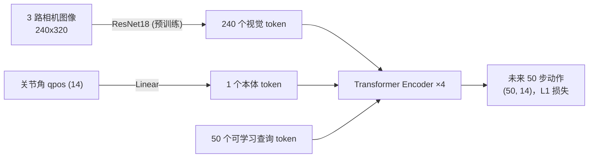

# 2026-07-18 (晚) · ACT 训练启动：数据工厂满负荷运转

## 今日目标

学习管线地基（[上一篇](2026-07-18-pipeline.md)）之上，完成训练轮的全部准备并启动：

1. 扩大采集到 200 条演示（后台自动运行）；
2. 实现 **ACT-lite** 模仿学习训练代码与评测协议；
3. 把数据、训练、评测的可视化记录固化到网站。

## 演示数据长什么样

一条演示数据 = 机器人"亲眼所见"（三路机载相机）+ 关节轨迹，50 Hz 同步录制。
下面是策略将要学习的真实输入（头部相机 + 双腕相机，随机化场景之一）：

<video controls src="../../assets/videos/pill_demo_data_sample.mp4"></video>

| 数据项 | 规格 |
|---|---|
| 观测 | 3 相机 × 240×320 JPEG（~8 KB/帧）+ 14 维关节角 |
| 动作 | 14 维位置伺服目标（双臂 6+1 爪 ×2，ALOHA 布局） |
| 单条 episode | ~1900 控制周期（38 s @ 50 Hz），约 50 MB |
| 采集速度 | ~32 s 墙钟/条，零人力（脚本专家 + 域随机化自动生成） |

采集进行中：**前 62 条全部成功**（随机化：盒 A ±2 cm、盒 B ±3 cm、
停车 ±1.5 cm/±2.5°、目标格随机），目标 200 条，全程后台无人值守。

## ACT-lite：为什么、是什么

**ACT**（Action Chunking Transformer）是 ALOHA 的原生模仿学习算法，核心思想是
**动作分块**：策略一次预测未来 50 步动作而不是 1 步——克服逐帧回归的误差累积，
也让 50 Hz 高频控制变得可行。我们实现的精简版（`train_act.py`，~200 行）：



与原版 ACT 的差异：去掉了 CVAE 风格编码器（单任务演示分布较集中，先用纯 L1
回归验证管线；多模态行为再加回来）。推理时每 0.5 s 重规划一次
（开环执行动作块前 25 步）。

## 评测协议（预注册，防自欺）

训练完成后按此协议评测，不临时改标准：

- **主指标**：同分布随机场景 × 20 次 rollout，撕剪入盒 B 成功率 / 全流程成功率；
- **对照组**：脚本专家在"错误标定"下的表现——人为给盒位加 3 cm 偏移但不更新脚本
  目标，模拟真机上"感知失准"场景。**如果 ACT 策略显著高于错标定脚本，
  就证明了"策略从图像适应位置"的价值**；
- **可视化**：每次评测录 3 条 rollout 三机位视频入网站。

## 踩坑与解决

1. **训练进程被文件锁卡死**：训练扫描 `demos/` 时打开了采集进程正在写的 HDF5，
   `h5py.File` 挂起无报错。解决：加 `--max-files` 参数错开在写文件；
   长期方案是"写临时名，完成后改名"。
2. **Windows 页面文件不足（WinError 1455）**：采集进程 + CUDA DLL 的提交内存
   （commit charge）叠加超过页面文件上限，`import torch` 都会失败。
   解决：写接力脚本 `wait_and_train.ps1`——轮询等采集进程退出，再启动训练，
   启动失败自动 5 分钟重试。教训：**GPU 训练与大批量仿真采集不要在
   内存受限的机器上并发**。
3. **PowerShell 脚本中文乱码**：无 BOM 的 UTF-8 中文注释会让 PowerShell 解析器
   报一堆语法错误。脚本内文案改英文，中文留给文档。

## 当前状态与下一步

- ⏳ 采集 → 训练接力运行中（采集 ~200 条 → ACT-lite 20k 步，预计数小时）；
- 下一步（训练完成后）：按预注册协议评测 + rollout 视频 + 结果分析日志；
- 之后：RL 精修撕剪接触环节（`pill_env.py` 的稀疏奖励与特权接口已就位）。

## 复现

```powershell
cd experiments\pill_sorting
..\..\.venv\Scripts\python.exe collect_demos.py --n 190 --seed 1 --start 10   # 扩采
..\..\.venv\Scripts\python.exe demo_to_video.py demos/episode_000_ok.hdf5 --out sample.mp4
..\..\.venv\Scripts\python.exe train_act.py --steps 20000 --batch 16          # 训练
..\..\.venv\Scripts\python.exe eval_act.py --n 20 --video                     # 评测
```
