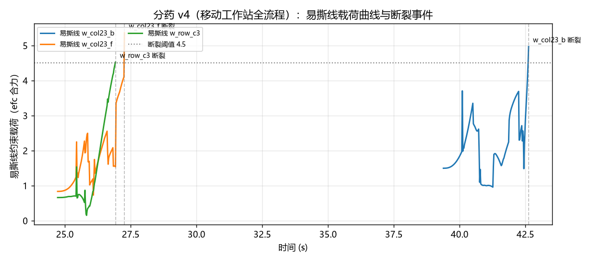
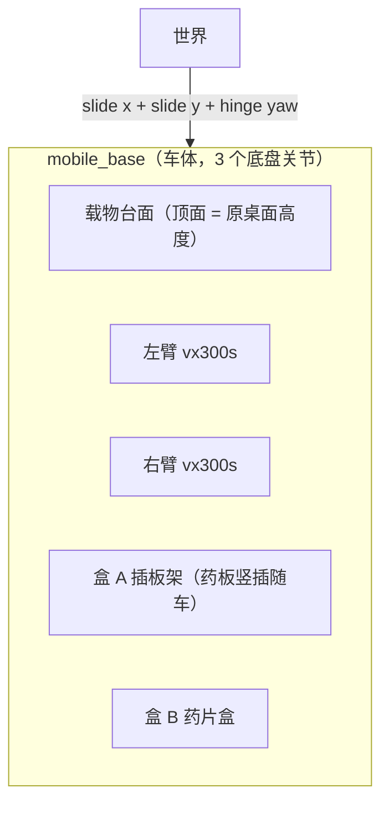

# 2026-07-18 · 分药 v4：轮式移动分药工作站

## 今日目标

- 让仿真平台与项目愿景（**双臂 + 轮式底盘**）对齐：固定双臂工作站改造成
  轮式移动分药工作站（Mobile ALOHA 思路），先导航、后操作，一条视频跑完
  "驶离充电桩 → 停到工作位 → 取板 → 撕剪 → 入盒 B → 放回盒 A"。

## 结果

**62 秒全流程一次跑通：行驶 9 秒到位，撕剪入盒 B 2/2，剩板插回盒 A 成功。**
最关键的数字：**行驶全程药板在盒 A 槽内的漂移只有 0.1 mm**——药板与车之间没有任何
固定，纯靠槽壁接触随车运输，min-jerk 速度轨迹的平缓加减速（峰值约 0.5 m/s²）足以稳住。

<video controls src="../../assets/videos/pill_full_v4_mobile_multicam.mp4"></video>



| 阶段 | 时间 | 内容 |
|---|---|---|
| 0 导航 | 0~9 s | 原地转向 → 直线行驶 1.4 m → 回正停稳（主视角切房间全景机位） |
| 1 取板 | 9~16 s | 左臂竖直下降夹住药板手柄，提出盒 A 槽位 |
| 2 转体 | 16~20 s | 板转到水平工作位（按"板要水平"反解手姿态） |
| 3-4 撕剪投放 ×2 | 20~48 s | 右手扭腕撕断易撕线，指尖朝下投入盒 B |
| 5 放回 | 48~62 s | 剩板转回竖直插回盒 A 槽位，松爪撤离 |

## 平台建模：把整个工作站装上轮子



- **双臂、台面、盒 A、盒 B 全部挂进 `mobile_base` 车体**——机器人是一台"移动分药车"，
  车开到哪就能在哪分药。这样做的最大好处是**操作编排 100% 复用**：台面顶面在车体
  局部系 z=0，与 v3 的桌面同高；车停到工作位（原点）后车体系与世界系重合，v3 的所有
  IK 目标、盒位坐标一个都不用改。
- **底盘 = 平面三关节 + 位置伺服**（世界系 x、y 平移 + 车体偏航），脚本按差速车的方式
  编排（原地转向 → 沿车头直行 → 回正），轮-地接触不建模，四个轮子是纯视觉几何。
  这是移动操作仿真的标准抽象：轮胎接触对操作任务没有信息量，还会拖慢仿真、引入噪声。
- 房间里添了药柜、矮柜、充电桩几个道具，主视角在导航阶段切到跟随车体的全景机位，
  到位后切回操作特写机位。

## 为什么不是"开到外部桌子前操作"？

那是另一种（也更常见的）移动操作形态，但对 ALOHA 的**面对面双臂布局**不友好：
面向外部桌子需要两臂并排朝前，整个工作位/IK 姿态体系要推倒重排。移动分药车形态
既贴合"分药车巡房"的产品叙事，又让 v3 打磨好的双臂协同全部保值。等升级到并排双臂
布局（如 Mobile ALOHA 真机）时，再做"车-桌"跨平台操作。

## 学到了什么

- **移动操作 = 导航段 + 操作段，衔接处是"基座标定"**：本次车停在预设工作位，
  车体系与世界系重合，操作目标直接复用。真机上车停不准（±cm 级），操作目标必须
  换到"感知到的物体系"下表达——我们现有的"实时读板位姿再算抓取点"已经是这个思路。
- **非固定载荷的运输约束**：药板插在槽里不固定，运输的本质约束是加速度上限
  （惯性力 < 槽壁支持力+摩擦）。min-jerk 位置轨迹天然给出平滑加减速，0.5 m/s²
  下漂移亚毫米。真机上这对应"端汤不洒"类的运动规划约束。
- MuJoCo 建模技巧：给车体一个大质量（60 kg）+ 关节阻尼，位置伺服的底盘就不会被
  臂的反作用力推走——操作时臂的动量会传给车，车重是"免费的稳定器"。

## 复现

```powershell
cd experiments\pill_sorting
..\..\.venv\Scripts\python.exe gen_tear_model.py   # 重新生成车体模型
..\..\.venv\Scripts\python.exe run_full_demo.py    # 62 秒全流程（三机位录像 + 载荷曲线）
```

## 明日计划

- 导航段升级：绕障路径（房间里的药柜/矮柜当障碍物）、停车位姿扰动 + 操作目标重标定
- 目标格随机化 + 撕剪顺序规划，然后包装成 Gymnasium 环境
