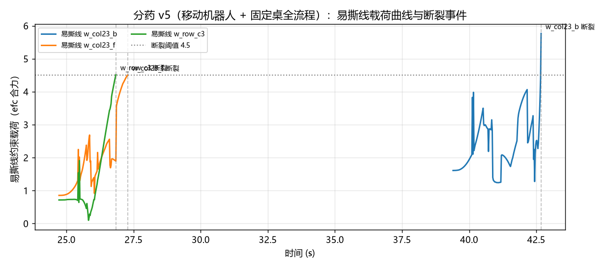
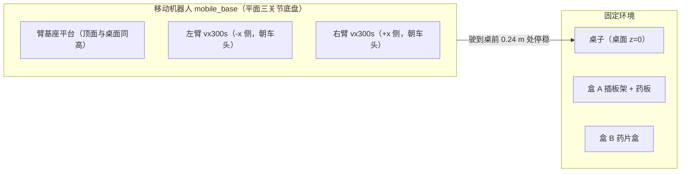

# 2026-07-18 · 分药 v5：轮式移动操作机器人 + 固定桌子

## 今日目标

- 让仿真平台与项目愿景（**轮式底盘 + 双臂的移动机器人**）对齐：机器人自己是移动的，
  盒 A（板架）、盒 B（药片盒）放在**固定的桌子**上；机器人驶到桌前停稳，
  用双臂完成取板 → 撕剪 → 入盒 B → 放回盒 A。

!!! warning "形态纠偏记录"
    第一版（v4）我们把双臂和盒子全装在一辆"移动分药车"上——操作坐标可以 100% 复用，
    改动最小，但**形态理解错了**：目标是"机器人移动去操作环境中的固定物品"，
    而不是"物品跟着机器人走"。纠正后（v5）双臂布局从 ALOHA 的"面对面"改成
    Mobile ALOHA 真机的"并排朝前"，操作几何全部重排。记下这个教训：
    **平台形态是需求，不是实现细节，动手前要跟需求方确认。**

## 结果

**62 秒全流程一次跑通：停车误差 0.0 mm，撕剪入盒 B 2/2，剩板插回盒 A 成功。**

<video controls src="../../assets/videos/pill_full_v5_mobile_multicam.mp4"></video>



| 阶段 | 时间 | 内容 |
|---|---|---|
| 0 导航 | 0~9 s | 原地转向 → 直线行驶 1.9 m → 回正停到桌前（主视角为房间全景机位） |
| 1 取板 | 9~16 s | 左臂越过桌沿，竖直下降夹住药板手柄，提出盒 A 槽位 |
| 2 转体 | 16~20 s | 板转到两臂中间的水平工作位（格朝上，自由端朝右臂侧） |
| 3-4 撕剪投放 ×2 | 20~48 s | 右臂绕到板自由端外侧夹住格缘，扭腕撕断，指尖朝下投入盒 B |
| 5 放回 | 48~62 s | 剩板转回竖直插回盒 A 槽位，松爪撤离 |

## 机器人建模：双臂从"面对面"到"并排朝前"



- **机器人**：小车体（0.6×0.4 m 底盘，带碰撞，防撞桌腿）+ 两条 vx300s 臂并排装在
  车顶平台前部（间距 0.47 m，同朝车头方向）——Mobile ALOHA 真机形态。臂基座平台
  与桌面同高，双臂越过桌沿在桌面上方操作。底盘仍是平面三关节 + 位置伺服的差速近似。
- **环境**：桌子（1.21×0.76 m，ALOHA 官方桌面网格）固定在房间中，盒 A、装饰板、
  药板、盒 B 全部是世界系固定/自由体，与机器人零耦合。
- **操作几何幸运地大部分保留**：并排布局下左臂仍在操作区 -x 侧、右臂在 +x 侧
 （与面对面布局的 x 相对关系一致），所以持板朝向、撕剪接近方向、竖直抓取/投放的
  **姿态轴约束全部不用改**，只挪了盒子和工作位的坐标。变化在臂的位形空间：
  同样的手部姿态，如今腕关节要侧弯 ~70°（臂从车侧伸向操作区，而非正对），
  好在 vx300s 腕部量程足够，IK 全部收敛到 0.1 mm。

## 踩坑与解决

1. **视频内存爆掉**：v5 场景几何变多，1545 帧 1280×1080 全部囤在内存再一次性编码，
   x264 分配失败（`malloc of size 4861824 failed`）。改成 `imageio.get_writer`
   流式写盘，逐帧喂给编码器，内存占用从 ~6 GB 降到常数级。
2. **停车与桌沿的间距**：车头缘停在 y=-0.04，桌沿 y=+0.02——底盘留 6 cm 间隙，
   臂基座距盒 A 约 0.39 m（vx300s 有效可达 ~0.6 m）。太远够不着、太近车体挡臂，
   这个"停车包络"在真机上就是导航终点容差的设计依据。
3. **载荷曲线拐点变化**：悬持板的支撑链路变长（车体→臂→板），第二格撕剪载荷
   爬升到 5.8 才断（此前 5.0），弹性变形更大——又一次印证"断裂阈值与持物刚度耦合"。

## 学到了什么

- **移动操作的坐标系分层**：环境物品在世界系、机器人在自己的底盘系，两者只在
  "停车位姿"处对接。v4（物品随车）回避了这个问题，v5 才是真正的移动操作结构——
  停车误差直接变成操作误差，真机上必须靠感知重标定吸收。
- **双臂布局决定可达域形状**：面对面布局的"甜区"在两臂连线中点；并排布局的甜区
  在车前方一个扇形带上。同样的任务，布局一换 IK 位形完全不同——布局设计
  要跟任务空间一起想。

## 复现

```powershell
cd experiments\pill_sorting
..\..\.venv\Scripts\python.exe gen_tear_model.py   # 重新生成机器人/场景模型
..\..\.venv\Scripts\python.exe run_full_demo.py    # 62 秒全流程（三机位录像 + 载荷曲线）
```

## 明日计划

- 停车位姿扰动 + 按实际停车位姿重标定操作目标（真机必备能力的仿真预演）
- 目标格随机化 + 撕剪顺序规划，然后包装成 Gymnasium 环境
