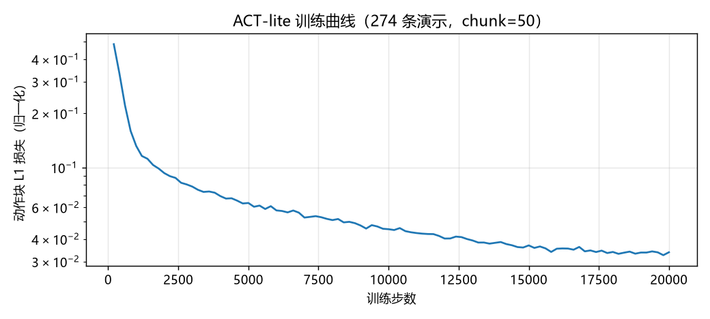

# 2026-07-18 (夜) · 首个学习策略达成：ACT 75%，七倍于错标定脚本

## 结果

流水线 v2（DART 带噪专家重采 → 重训 → 预注册评测）完成。
**首个从像素学到的分药策略诞生**——三层修复（[破案日志](2026-07-18-debug.md)）全部生效：

| 同一随机场景序列 × 20 | 撕剪入盒 B | 全流程（含放回盒 A） |
|---|---|---|
| 完美标定脚本专家（上界） | 100% | 100% |
| 错标定 3 cm 脚本专家（对照） | 65% | **10%** |
| **ACT 视觉策略（本次）** | **80%** | **75%** |

**核心结论**：面对 3 cm 级的位置不确定性，写死坐标的脚本几乎全灭（全流程 10%），
而闭环视觉策略保住了 75%——**7.5 倍差距，"从图像适应位置"的价值首次被自己的
实验定量证明**。这正是[第二课](../concepts/from-script-to-policy.md)预言的：
脚本把世界写进代码，策略把世界留在输入里。

策略 rollout 实录（策略自己看图闭环控制，非脚本）：

<video controls src="../../assets/videos/act_rollout_0.mp4"></video>



## 这一版为什么成了

对照上一篇的三层修复，各自的贡献：

1. **环境物理补全**（抓取锁定、撕裂规则入环境）——没有它，任何策略都物理上
   不可能成功（重放实验证明）；
2. **任务条件 token**——没有它，策略输出 3f/3b 两类演示的平均动作；
3. **DART 带噪专家 + 传感器 dropout**——治好相位死锁：带噪演示教会策略
   "偏了怎么拉回来"，图像 dropout 逼出 qpos 相位时钟。
   带噪专家采集成功率 94%（274 成功 / 290 总数），失败条自动丢弃不入训练集。

失败的 4/20 集中在两类：撕剪时格子滑脱（接触力时机偏差）和投放弹出盒沿——
都是接触环节的精度问题，正是下一阶段 RL 精修的目标。

## 数字背后的工程账

- 数据：274 条带噪演示（~14 GB，全自动采集，零人工遥操作）；
- 训练：20k 步 / 45 分钟（RTX 4080，bf16）；
- 评测：20 rollout × ~55 s 仿真；
- 从"决定做模仿学习"到"75% 策略"总计一天，其中三分之二时间花在
  两轮失败的诊断上——**这个比例是常态而非例外**，诊断工具
  （重放测试、相位追踪、分布内外对比）是最值得沉淀的资产。

## 下一步

- **RL 精修接触环节**：撕剪滑脱与投放弹出是稀疏奖励 + 特权信息教师的
  理想练兵场（`pill_env` 接口已就位）；
- **扩大随机化**：当前策略只见过 ±2~3 cm 扰动；курс式扩大到 ±5 cm、
  加光照/纹理随机化，测泛化边界；
- **VLA 微调**：把 274 条数据转 LeRobot 格式，微调 π0/OpenVLA，
  对比小模型 ACT 与预训练大模型的数据效率。

## 复现

```powershell
cd experiments\pill_sorting
powershell -ExecutionPolicy Bypass -File pipeline_v2.ps1   # 采集→训练→评测全流程
..\..\.venv\Scripts\python.exe eval_act.py --n 20 --video  # 仅评测
..\..\.venv\Scripts\python.exe eval_miscalib.py --n 20     # 错标定对照组
```
