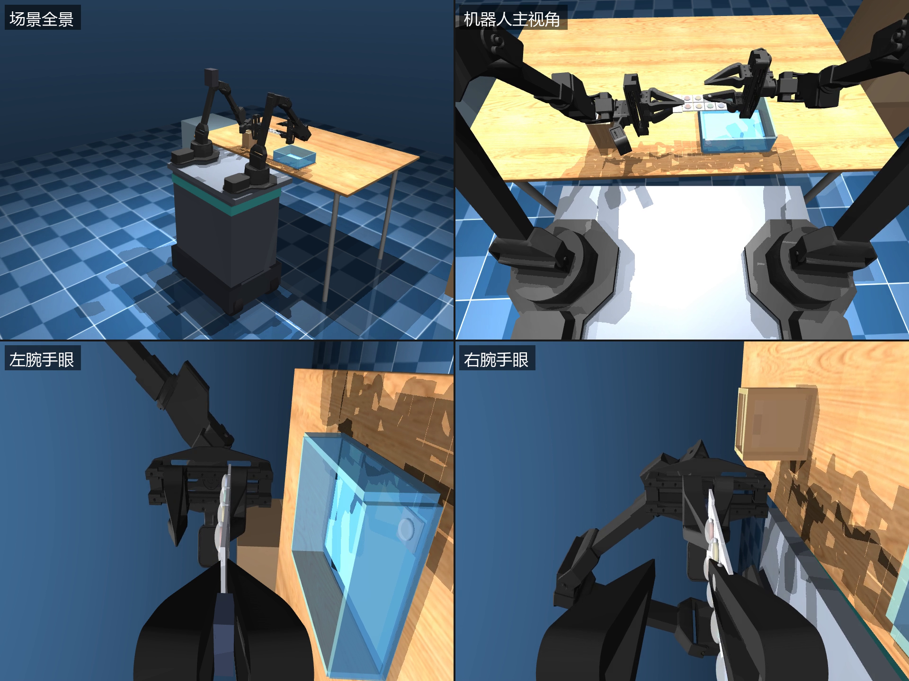
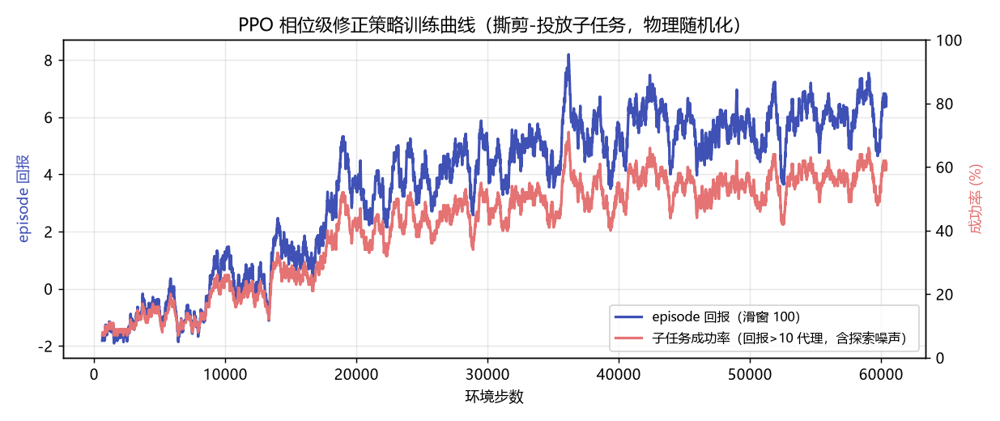

# 2026-07-18 (深夜) · RL 精修接触环节：40% → 92%，附一次教科书级 reward hacking

## 想解决什么

ACT 策略 75% 之后，[结果日志](2026-07-18-result.md)里预告的下一步：
剩余失败集中在两个**接触环节**——撕剪时格子滑脱、投放时弹出盒沿。
这类失败的共同点是：它们取决于**物理参数**（摩擦、质量、易撕线强度）
和**毫米级的对准误差**，而这些量在脚本和 BC 演示里都是"隐形"的——
脚本假设它们恒定，演示数据里它们从未变化。

治法就是强化学习的主场：把这些物理量**随机化**，让策略在打滑、撕不断、
弹出的失败中学会用状态反馈实时调整。这一篇实现的是
**残差 RL（residual policy learning）+ 特权信息教师**的第一步。

## 方法：站在脚本肩膀上学，但"肩膀"选在哪一层？

从零训练一个 RL 策略做完整撕剪要面对可怕的探索问题（稀疏奖励 +
接触密集）。思路是不推倒重来，在脚本名义编排之上学修正。
但"修正"加在哪一层，直接决定成败——这一篇为此付了一次学费（见下）。

最终方案：**相位级修正（semi-MDP）**。脚本编排本来就是相位序列
（接近 → 抓取 → 闭爪 → 扭腕 → 补拉 → 提起 → 投放 → 松爪 → 抖腕），
RL 策略在**每个相位入口**决策一次（每 episode 仅 ~13 个决策点）：

```
动作（5 维）: [该相位 IK 目标位置修正 ±30mm，夹爪过盈修正 ±2mm，扭腕幅度 ×0.5~1.5]
零动作     = 完整复现脚本
```

- **零动作 = 原脚本**：策略初始化即拥有脚本的全部能力，学习只需要
  "把失败场景修好"，不需要重新发明撕剪动作；
- **修正有界**：±30 mm 任务空间偏移，物理上限制了策略能造成的破坏
  （安全性天然更好，这对医疗场景很重要）；
- **特权观测**：真值格/板位姿、易撕线载荷、接触数、物理参数 θ 本身——
  仿真里免费，真机上没有。所以这个策略的定位是**教师**：
  下一步把它的行为蒸馏回只看图像+本体感知的学生策略（DAgger 式）。

### 子任务环境 TearRefineEnv

把"撕剪目标格 → 投入盒 B"从 55 秒全流程中切出来（~15 秒），
episode 从**重置池**的状态快照开始——64 个随机场景各自跑完脚本的
"取板 → 工作位"前缀后存盘（XML + qpos/qvel + 左爪锁定位姿），
reset 直接恢复快照，训练吞吐不用为取板阶段买单。

物理随机化（每 episode 重采样）：

| 参数 | 范围 | 制造的失败模式 |
|---|---|---|
| 右爪指垫摩擦 | ×[0.25, 1.3] | 低摩擦 → 扭腕反力下格子滑脱 |
| 板格质量 | ×[0.6, 2.0] | 重格 → 运送/投放动力学变化 |
| 易撕线断裂阈值 | ×[0.8, 2.2] | 高阈值 → 扭到头也不断，需要补拉 |
| 感知偏移 | 水平 ±18 mm、竖直 ±4 mm | 抓浅（滑脱）/ 投偏（弹出盒沿） |

奖励塑形：入盒 +10、撕断 +3、闭爪合格 +0.5、载荷推进（挤向阈值）小额
密集奖励；落盒外 −3、拽脱整板 −3、扭+拉仍未断 −3；残差幅度小惩罚。

### 一个必须先做的实验：脚本基线到底差不差？

第一版随机化只动了纯物理量（摩擦/质量/阈值 ±30~50%），结果零动作
脚本 **40/40 全成**——编排比预想的鲁棒（大过盈捏 2.4 mm 板 + 断裂即停
的自适应扭腕，本来就是几轮踩坑调出来的）。差点做了个"没有病人的手术"。

把随机化的重心移到**感知偏移**（最终 ±25 mm，与[错标定实验](2026-07-18-result.md)
的 3 cm 同量级，对应真机手眼标定 + 位姿估计误差）后，脚本基线掉到
**40%（16/40）**——失败模式和 ACT 评测里看到的一模一样：抓浅单指
接触撕不动、扭拉无效，投放砸在盒沿弹出。这才有了值得精修的对象。

## 学费：逐步残差 RL 的失败

第一版是教科书式的 residual policy learning：50 Hz 每个控制周期输出
右臂 6 关节 ±0.05 rad + 夹爪 ±1.5 mm 的**逐步残差**。PPO 训了 3.5M 步
（两轮 × ~50 分钟），结果配对评测 **68% vs 脚本 70%**——不仅没修好
失败场景，还把 13 个脚本本来能成的场景搅失败了。

复盘找到三个结构性问题：

1. **credit assignment 太难**：一个 episode ~750 个残差决策，成功奖励
   +10 摊到每步只剩噪声级信号；而残差幅度惩罚每步都在，策略最优解
   变成"少动"与"乱动"之间的平庸折中；
2. **残差和名义编排打架**：脚本的 IK 途经点是相位入口算好的，逐步
   残差在执行途中持续扰动伺服目标，min-jerk 轨迹的平滑性被破坏，
   投放落点方差反而变大；
3. **真正需要修的量本来就是相位级的**：抓深一点（IK 目标 +x 几毫米）、
   捏紧一点（过盈 +0.5 mm）、扭多一点（幅度 ×1.3）、投准一点（落点
   平移到真值盒心）——全是每相位一个数的决策，不是 50 Hz 的连续控制。

改成相位级 semi-MDP 后，同样的 PPO、同样的奖励结构，
决策序列从 750 步缩到 13 步。

## 又交一次学费：教科书级 reward hacking

相位级第一轮训练收敛飞快，回报一路涨到 12.9——但 episode 长度平均
只有 **2.5 个决策**。正常成功要 11 个相位，2 个相位就"成功"了？

抽帧一看，策略发明了一套邪道打法：**接近相位就把 ±30 mm 修正量全部
怼向药板，用张开的指尖猛压目标格边缘**——易撕线在冲击载荷下超阈值
断裂，而工作位恰好悬在盒 B 正上方，格子自由落体直接进盒。
撕断 +3、入盒 +10，两步到账，比老老实实夹持-扭腕-运送快五倍：



问题出在环境物理的一个漏洞：断裂判定只要求"手指接触 + 载荷超阈值"，
而**单指怼压也算接触**。修复直接封在物理规则里（比改奖励函数更稳）：
撕裂的前提"边界受夹"改为**两侧手指同时接触**板格才算夹持——张爪怼压
不再能触发断裂。零动作冒烟重验 8/8（专家是真夹持，不受影响）。

这个插曲留下两个提醒：

- **RL 会精确优化你写下的奖励，而不是你心里想的任务**。奖励没错，
  错的是物理规则里没堵住的捷径；
- 修复漏洞要**修在环境物理层**（什么是"夹持"），而不是奖励层
  （惩罚"怼"这个动作）——前者一劳永逸，后者是打地鼠。

顺带的收获：堵上漏洞后重测脚本基线，从 68% 掉到 40%——之前脚本
在感知偏移下的部分"成功"其实也在无意识地薅这个漏洞的羊毛
（抓浅到只有单指接触，却照样判定撕断）。物理规则收紧让基线
更诚实了。

一个容易踩的连带坑：这条规则**不能**同步收紧到 ACT 的评测环境
（`PillTearEnv`）——ACT 的训练数据是在单指规则的物理下采的，评测
环境事后改规则等于换考卷（实测收紧后 ACT 从 75% 跌到 20%，回滚后
复验恢复 85%/80%）。训练分布与评测物理必须一致，这是[破案日志](2026-07-18-debug.md)
用一整天换来的教训，差点在这里重蹈覆辙。

## 训练

- PPO（stable-baselines3），MLP 256×256，8 并行环境（SubprocVecEnv），
  CPU 训练（状态观测不需要 GPU，也避开了 Windows 上 CUDA DLL 的虚存坑）；
- 60k 决策步（~9000 episodes）约 90 分钟。

**又踩一个 Windows 内存坑**：第一次训练 20 分钟后 worker 崩溃
`engine error: Could not allocate memory`。原因是每次 reset 都
`MjData(model)` 重新分配 + 每次 IK 求解也临时建 mjData，长训练下内存
碎片化耗尽。修复：模型/数据/IK 暂存全部按重置池条目**缓存复用**，
重置池按 worker 分片（每个子进程只编译自己那 1/8 的场景）。



（红线是探索噪声下的成功率，收敛在 ~65%；关掉噪声的确定性策略见下表。）

## 结果：92% vs 40%，配对对比

同一批（场景 × 物理参数 θ）让两个控制器各跑一遍（配对消除随机化方差）：

| 40 组相同条件 | 撕断 | 入盒 B（子任务成功） |
|---|---|---|
| 零动作脚本（基线） | 16/40 | 16/40 = **40%** |
| **PPO 相位级修正** | 37/40 | 37/40 = **92%** |

配对细节：**脚本败而 RL 成 24 组**，脚本成而 RL 败仅 3 组。
RL 学到的修正与失败机理严丝合缝：

- 感知偏移大时，抓取相位的 IK 目标被推回真值抓取点附近（策略从
  特权观测里直接读得到偏移量——这正是"特权教师"设定的意义）；
- 断裂阈值高的场景把扭腕幅度拉到 ×1.5，低摩擦场景把夹爪过盈加深；
- 投放相位把落点修回真值盒心，弹沿失败几乎消失。

RL 修正策略实录（脚本在同条件下失败的场景）：

<video controls src="../../assets/videos/rl_refine_0.mp4"></video>

## 对 ACT 策略意味着什么

这个教师策略与 ACT 的关系是接力，不是替代：

- ACT（视觉，无特权信息）在**标称物理**下 75%，短板是接触环节；
- RL 教师在**恶劣物理随机化**下 92%，但它看得见真值——真机上不存在；
- 下一步 **DAgger 蒸馏**：用 RL 教师在随机化场景里生成"会自救"的
  演示（尤其是脚本专家做不出的纠错行为），把这些能力灌回
  只看图像+本体感知的学生策略。

## 学到了什么

1. **先证明基线会失败，再谈精修**——第一版物理随机化下脚本全成，
   说明"哪些扰动才是真敌人"必须实验测定，不能拍脑袋。这个项目里
   反复出现的教训：感知误差 > 纯物理参数误差。
2. **修正加在哪一层比算法本身更重要**：逐步残差（教科书做法）3.5M 步
   学不过基线；相位级修正 60k 步就到 92%。动作空间要和"真正需要
   决策的量"同构。
3. **RL 优化的是写下的奖励，不是心里的任务**：reward hacking 不是
   bug 是 feature——它免费帮你审计环境规则的漏洞。修复要修在
   物理层，不是奖励层。
4. **特权教师只是第一步**：它看得见真值载荷、物理参数、感知偏移，
   真机上都没有。价值在于生成"会自救"的演示数据供学生策略蒸馏。

## 复现

```powershell
cd experiments/pill_sorting
..\..\.venv\Scripts\python.exe tear_refine_env.py --gen-pool 64   # 重置池（~2.5 分钟）
..\..\.venv\Scripts\python.exe tear_refine_env.py --smoke         # 一致性检查（应全成）
..\..\.venv\Scripts\python.exe tear_refine_env.py --baseline 40   # 脚本基线（40%）
..\..\.venv\Scripts\python.exe train_ppo_refine.py --steps 60000  # ~90 分钟（CPU）
..\..\.venv\Scripts\python.exe eval_refine.py --n 40 --video      # 配对评测 + 视频
..\..\.venv\Scripts\python.exe plot_refine_curve.py               # 训练曲线
```
