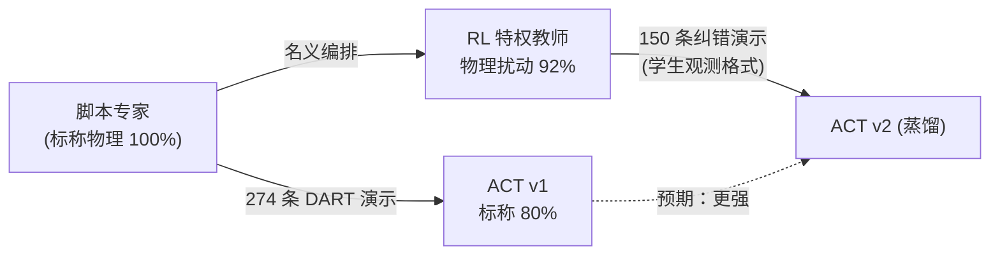

# 2026-07-19 · DAgger 蒸馏首战：一次干净的负迁移，和它教会我们的事

## 想做什么

到昨天为止，两条线各自到顶但互不相通：

- **ACT 学生**（视觉 + 本体，真机可部署）：标称物理下全流程 80%；
- **RL 教师**（特权信息，仿真专用）：恶劣物理随机化下子任务 92%。

计划是教科书式的**教师 → 学生蒸馏**：RL 教师在物理随机化场景里做示范，
用学生的观测格式（三路相机 + 关节角 + 14 维控制流）记录成演示，
混入原 274 条脚本演示重训 ACT——让视觉策略也获得抗物理扰动的能力。



工程上全部走通：教师演示采集管线（`collect_teacher_demos.py`，
150 条 / 26 分钟，成功率 90%）、混合重训、`PillTearEnv` 增加物理
随机化评测档。但结果打脸了。

## 结果：2×2 对照，蒸馏两档全降

预注册协议：同一物理参数序列（rng 与场景 seed 解耦），每档 20 rollout。
物理随机化档 = 摩擦 ×[0.25,1.3]、质量 ×[0.6,2.0]、断裂阈值 ×[0.8,2.2]。

| 撕剪入盒 B / 全流程 | 标称物理 | 物理随机化 |
|---|---|---|
| **ACT v1（只学脚本演示）** | **85% / 80%** | **80% / 75%** |
| ACT v2 蒸馏第一轮（教师完整偏移分布） | 75% / 65% | 70% / 65% |
| ACT v2 蒸馏第二轮（偏移截幅 ±5mm） | 75% / 75% | 70% / 60% |

两轮蒸馏（第二轮修掉了第一轮发现的"教师绕路"问题——教师先奔向带
感知偏移的假目标再修正回来，对看不见偏移的学生是无法解释的噪声）
都是**负迁移**：不仅扰动档没升，标称档也掉了。

蒸馏版 rollout 实录（物理随机化档，四视角高清）：

<video controls src="../../assets/videos/act_distill_rollout_0.mp4"></video>

## 为什么负迁移：其实早有证据

复盘时发现，判定"蒸馏会有收益"时忽略了自己一周前的两个实验数字：

**1. 教师的核心本领，学生根本不需要。** RL 教师 92% vs 脚本 40% 的
巨大差距，大头来自**修正感知偏移**（±25 mm 标定误差）——配对评测的
分桶图显示偏移 >18 mm 时脚本 14% vs RL 100%。但视觉学生直接看像素，
**天然没有标定误差问题**。教师最值钱的本领对学生是无用功。

**2. 可转移的部分本来就小。** 纯物理量扰动（摩擦/质量/阈值）下，
[RL 精修日志](2026-07-18-rl.md)的第一次基线实验早就测过：**脚本
40/40 全成**——大过盈捏板 + 断裂即停扭腕对这些扰动天然鲁棒。学生 v1
的成绩也印证了（扰动档只比标称掉 5 个点）。教师能教的增量趋近于零。

**3. 换来的是纯粹的分布伤害。** 教师演示的动作风格与脚本不同
（更深咬、扭满、子任务从工作位快照开始），×3 重加权混入后，
学生在两种风格之间摇摆——标称档从 85/80 掉到 75/75 就是代价。
收益趋近零、成本实打实，净效果为负。

一句话：**蒸馏前应该先算"教师优势中有多少对学生可转移"**——
这道算术我们的数据早就给出了答案（≈0），只是没在开工前把数字连起来。

## 那 RL 教师白练了吗？

没有。它的价值定位需要修正：

- 它证明了**相位级修正 + 特权状态反馈**能把接触子任务在恶劣扰动下
  推到 92%——这个能力在**真机标定误差**场景下才真正兑现
  （真机脚本一定有标定误差，而真机没有仿真真值可用，需要的正是
  从可观测信号里推断误差的策略）；
- 对**视觉学生**，正确的强化路径不是蒸馏教师演示，而是：
  (a) 在学生自己的失败分布上做 DAgger（用教师/脚本重标注学生
  rollout 的失败段），或 (b) 直接对学生做 RL 微调（以 BC 策略为
  初始化，稀疏奖励精修）——两者都以学生的分布为中心，不引入
  异质风格。

主线模型维持 **ACT v1**（`ckpt/act_latest.pt`）。

## 学到了什么

1. **负迁移是蒸馏的默认风险，不是意外**：教师和学生的观测空间不同时，
   教师的能力未必可表达、教师的行为未必可解释（绕路问题）。
   开工前先做"可转移性算术"。
2. **自己的历史实验数据是最好的先验**——"脚本在纯物理扰动下 40/40"
   这个数字躺在三天前的日志里，足以预言这次结果。记录的价值
   在于此，回看的纪律同样在于此。
3. **快速失败的基础设施是划算的**：整条蒸馏管线（采集/重训/双档评测）
   一晚跑完两轮，负结果的确认成本低到可以坦然接受。

## 复现

```powershell
cd experiments/pill_sorting
..\..\.venv\Scripts\python.exe collect_teacher_demos.py --dry 20    # 教师成功率烟测 (18/20)
..\..\.venv\Scripts\python.exe collect_teacher_demos.py --n 150     # 采教师演示 (~26 min)
..\..\.venv\Scripts\python.exe train_act.py --steps 20000 --out-tag act_distill --teacher-repeat 3
..\..\.venv\Scripts\python.exe eval_act.py --n 20 --ckpt act_latest.pt --phys 1.0          # v1 扰动档
..\..\.venv\Scripts\python.exe eval_act.py --n 20 --ckpt act_distill_latest.pt             # v2 标称档
..\..\.venv\Scripts\python.exe eval_act.py --n 20 --ckpt act_distill_latest.pt --phys 1.0 --video --tag act_distill
```
