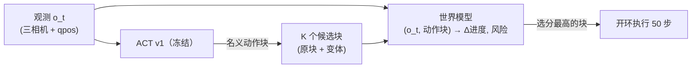
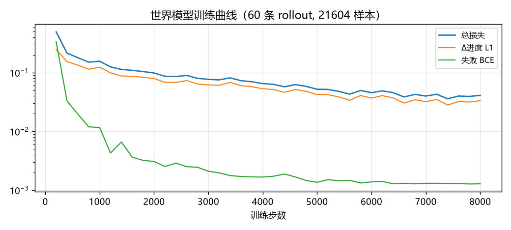
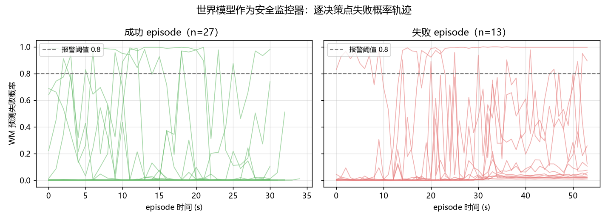

# 2026-07-19 (下) · ACT + 世界模型：把关人无事可做，监控器初见价值

## 换个思路强化 ACT

蒸馏[负迁移复盘](2026-07-19-distill.md)的结论是：往 ACT 里灌异质演示
会伤分布，正确路径要**以学生自己的分布为中心**。这一篇按此原则引入
世界模型（三主题 RL / WM / VLA 的最后一块拼图）：

**不动 ACT 的权重，给它配一个"把关人"。**



动机对准 ACT 的真实短板：开环执行 50 步动作块，块内不闭环——接触
失误发生了才后知后觉。WM 在**执行前**预判"这个块会导致什么"，从候选
中拒掉坏块（policy proposes, model disposes，TD-MPC/MBOP 提议-评估
机制的最小实现）。

## 世界模型跟谁学：ACT 自己的失败

**样本 = (o_t, 动作块) → (Δ进度, 失败概率, 未来 qpos)**。数据是
ACT v1 自跑的 100 条 rollout（标称/物理扰动各半，成功 74 / 失败 26），
带特权进度标签（latched/撕断/入盒/回槽四事件单调累积，只当训练标签）。

跟 ACT 自己的 rollout 学而不是跟专家学，是与蒸馏最关键的区别：
训练分布 = 部署分布，且**失败样本是核心资产**——演示数据全是成功，
永远学不出"什么会坏事"。



## 结果一：把关人无事可做（且这个判断是对的）

三轮迭代，结论层层递进：

**第一轮（无门控）**：WM 对 K=8 随机扰动候选自由选优——54/55 个
决策点都改选了扰动块，评分噪声主导，等效持续注入执行噪声，标称档
当场崩掉。教训：**把关人必须谦逊**——加保守门控（候选须显著优于
原块才改选，零噪声候选恒在集合中保证行为可退化为纯 ACT）。

**第二轮（门控 + 随机候选）与第三轮（门控 + 结构化候选：捏紧/放松
爪、扭幅/腕角变体）**：两档 20 rollout，改选次数 **0**——WM 认为
所有候选都跟原块没差别，行为完全退化为纯 ACT（成绩与基线在评测
噪声内一致：标称 85/80，扰动 80/80）。

是 WM 瞎吗？诊断（`diagnose_wm.py`）说不是：

- 成功/失败 episode 的状态样本，WM 评分分离 0.30（AUC 0.94，训练集）；
- 但同一状态下 K 个候选块的评分展布只有 **0.003~0.016**——比状态间
  差异小两个数量级。

**WM 的判断是对的：这些候选块之间本来就没有实质差异。** 50 步
±0.012 rad 的扰动（或单自由度的小变体）在绝大多数状态下确实不改变
成败——ACT 的失败源自感知与接触的系统性偏差，不是"块与块之间选错"。
把关机制的上限由**提议者的多样性**决定：ACT-lite 是确定性模型
（当年简化时去掉了 CVAE），它的"K 个候选"是伪多样性，把关人没得选。
这也解释了为什么 TD-MPC 家族必须配 CEM / 随机策略做提议。

## 结果二：意外收获，WM 是个中等水平的安全监控器

把关不成，但 fail 头（失败概率预测）单独拿出来是另一个故事：
逐决策点跑一遍 rollout，成功/失败 episode 的概率轨迹形态明显不同——



在**留出集**（40 条未参与训练）上评估"连续 N 点超阈值即报警停机"：

| 规则 | 召回（失败被预警） | 误报（成功被误警） | 预警提前量 |
|---|---|---|---|
| >0.5 连续 3 点 | 4/13 = 31% | 4/27 = 15% | 中位 39 s |

数字只能算中等（失败头的标签是 episode 级蒙特卡洛，噪声大；
且撕剪失败在图像上本来就是渐显的）。但**语义正确**：分药是
"宁可停机呼人、不可分错"的场景，一个能提前半分钟把三成事故
变成"报警 + 人工确认"的监控器，是有产品意义的组件雏形——
改进方向也明确（步级失败标签、时序上下文、校准）。

把关版 rollout 实录（扰动档，行为与纯 ACT 一致——改选 0 次本身
就是这次实验的结论）：

<video controls src="../../assets/videos/act_wm_rollout_0.mp4"></video>

## 学到了什么

1. **"提议-把关"架构的瓶颈在提议端**：确定性策略加噪声得不到
   有意义的候选多样性。要让 WM 有用武之地，先得有会"想不同办法"
   的策略（CVAE-ACT / 扩散策略），或者让 WM 直接参与动作优化（CEM）。
2. **把关人必须谦逊**：无门控的第一轮实验里，一个判别力不错的
   模型照样把系统搞崩——干预机制的默认行为应该是"不干预"。
3. **模型判断"没差别"也是有效信息**：诊断展布 0.003 的那一刻，
   问题从"WM 不行"翻转成"候选不行"——先怀疑输入，再怀疑模型。
4. **失败数据的第二种变现**：同一批 rollout 数据，把关不成，
   却能训练出风险监控器。围绕安全的功能对医疗产品可能比
   "多救回 5% 成功率"更值钱。

## 三主题至此各就其位

| 主题 | 在本项目中的角色 | 状态 |
|---|---|---|
| 模仿学习（ACT） | 主策略：像素 → 动作，标称 85/80 | 主线 |
| 强化学习 | 特权教师修接触子任务（92%），蒸馏未过关 | 教师可用 |
| 世界模型 | 把关无效（提议太窄），安全监控雏形 | 监控方向 |
| VLA（待办） | 大模型 BC 对比数据效率 | 下一步候选 |

## 复现

```powershell
cd experiments/pill_sorting
..\..\.venv\Scripts\python.exe collect_rollouts.py --n 100          # ACT 自采数据 (~70 min)
..\..\.venv\Scripts\python.exe train_wm.py --steps 8000 --holdout 60
..\..\.venv\Scripts\python.exe eval_act_wm.py --n 20 --k 8          # 标称档
..\..\.venv\Scripts\python.exe eval_act_wm.py --n 20 --k 8 --phys 1.0 --video
..\..\.venv\Scripts\python.exe diagnose_wm.py                       # 判别力诊断
..\..\.venv\Scripts\python.exe wm_alarm_analysis.py --thresh 0.5 --consec 3 --holdout 60
```
