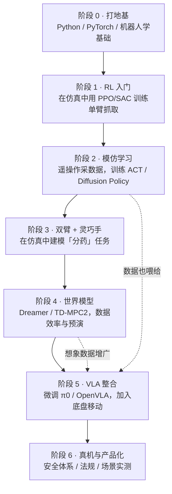
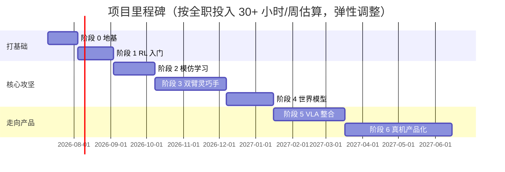

# 学习路线图

!!! quote "总原则：仿真先行，真机验证，安全兜底"
    机器人学习领域有一条铁律——**真机时间极其昂贵，且失败可能损坏硬件**。所以我们所有技能先在仿真中打磨（阶段 1~4），再逐步过渡到真机（阶段 5~6）。每个阶段都有明确的"毕业作品"，完成它才进入下一阶段。

## 全景图

## 各阶段详情

### 阶段 0 · 打地基 进行中

**目标**：具备读懂论文代码、跑通仿真环境的基本功。

| 内容 | 资源 | 毕业标准 |
|---|---|---|
| ~~Python + PyTorch~~ | 已具备 ✔ | 跳过（已有 PyTorch 训练经验） |
| RL 基础理论 | Sutton & Barto 前 6 章 / HF Deep RL Course | 能讲清楚 MDP、值函数、策略梯度 |
| 机器人学基础 | 正逆运动学、坐标变换、URDF | 能看懂一个机械臂的 URDF 并解释各关节 |
| 仿真环境 | MuJoCo + Gymnasium | 跑通 `Hopper-v4` 训练并录制视频 |

### 阶段 1 · RL 入门实战 未开始

**目标**：亲手训练出第一个操作策略，建立对"奖励设计、探索、样本效率"的直觉。

- 用 **PPO / SAC** 在 MuJoCo 或 ManiSkill 中训练单臂完成 reach → push → pick-and-place 三连
- 学会看训练曲线：回报、成功率、熵、值函数损失
- 体会**奖励塑形（reward shaping）**的威力与陷阱
- **毕业作品**：一段单臂抓取的仿真视频 + 一篇训练曲线分析日志

### 阶段 2 · 模仿学习与数据 未开始

**目标**：理解现代机器人操作的主流范式——**从人类演示中学习**。

- 学习 **ACT**（Action Chunking Transformer，Mobile ALOHA 同款）与 **Diffusion Policy** 两大主流模仿学习算法
- 用 **LeRobot**（Hugging Face 出品）框架跑通"数据采集 → 训练 → 评估"全流程
- 了解遥操作方案：主从臂（ALOHA/GELLO）、VR 手柄、视觉动捕（灵巧手用 DexCap 等）
- **毕业作品**：在仿真中用 ≤50 条演示训练出成功率 >80% 的抓取策略

### 阶段 3 · 双臂协同 + 灵巧手 未开始

**目标**：把"分药"任务在仿真中完整建模并训练出第一版策略。这是**本项目的核心攻坚阶段**。

- 搭建分药仿真场景：铝塑板（可变形/可破坏建模是难点）、药杯、药片
- 对比三指夹爪 vs 五指灵巧手在此任务上的表现（详见[硬件选型](hardware/index.md)）
- 双臂协同：一臂固定药板，一臂拇指按压；研究力控与柔顺控制
- **毕业作品**：仿真中完整"按出一粒药片并投入药杯"的演示视频

### 阶段 4 · 世界模型 未开始

**目标**：用世界模型提升数据效率，并让机器人具备"预演"能力。

- 学习 **DreamerV3**（在想象中训练策略）与 **TD-MPC2**（模型预测控制 + 学习模型）
- 探索视频世界模型（如 Genie 类模型）用于数据增广的可能性
- 在分药任务上对比：纯 RL vs 世界模型 RL 的样本效率
- **毕业作品**：一篇对比实验报告（曲线图 + 分析）

### 阶段 5 · VLA 整合与移动操作 未开始

**目标**：接入预训练 VLA 大模型，获得指令理解与泛化能力，并加入底盘。

- 微调开源 VLA（候选：**π0 / OpenVLA / RDT-1B / GR00T N1**）适配我们的双臂平台
- 移动操作（mobile manipulation）：底盘与双臂的全身协同（whole-body control）
- 长时序任务编排："导航到药柜 → 取药板 → 分药 → 递送"
- **毕业作品**：仿真或真机中一次端到端的"语音指令 → 完成分药"演示

### 阶段 6 · 真机部署与产品化 未开始

**目标**：从"能跑的 demo"到"可信赖的产品原型"。

- **安全体系**：力/力矩限制、软急停、虚拟墙、人体检测降速，参考 **ISO 13482**（个人护理机器人安全标准）
- 量血压任务真机攻关（人机物理交互，安全等级最高）
- 可靠性工程：失败检测与自动恢复、成功率长期统计
- 合规调研：医疗器械相关法规边界（血压计本身是二类医疗器械，机器人只做"辅助操作"可规避部分认证，需要专业论证）
- **毕业作品**：产品需求文档（PRD）+ 真机演示视频 + 安全性测试报告

## 里程碑时间轴（预估）

!!! info "节奏依据"
    学习者全职投入且已有 PyTorch 基础，算力为 RTX 4080（16 GB）——足以本地运行 Isaac Lab / ManiSkill 的 GPU 并行仿真，因此阶段 1、3 的训练迭代可以显著提速。

!!! warning "预期管理"
    这条路线全球顶尖实验室也仍在攻坚：分药级别的精细双手操作接近当前研究前沿，量血压的人机物理交互更是尚无成熟产品。我们的策略是**把每一阶段的产出都做扎实**——即使最终产品形态调整，积累的技能、数据和代码都是可复用的资产。
