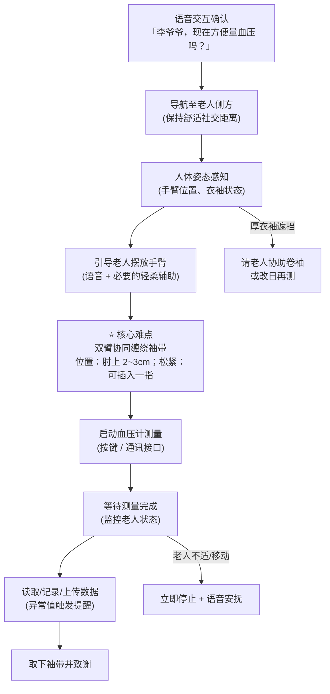
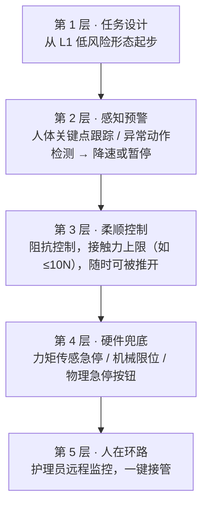

# 任务 B · 测量血压

> **场景**：老人坐在椅子上，机器人为其佩戴上臂式电子血压计袖带，启动测量，读取并记录结果。**这是全项目安全等级最高的任务。**

## 任务全流程分解

## 为什么这个任务如此之难？

1. **直接物理接触**：机器人手臂在老人手臂周围运动，任何轨迹误差都可能碰撞；老人皮肤脆弱，轻微剐蹭也是事故。
2. **对象不可控**：老人可能突然移动、抖动，甚至因紧张而抗拒。系统必须实时感知并瞬间让步（柔顺）。
3. **柔性物体操作**：袖带是软的，缠绕过程状态空间巨大，松紧还直接影响测量准确性（过松偏低，过紧偏高）。
4. **仿真困难**：人体软组织 + 柔性袖带的高保真仿真接近当前技术边界，意味着难以靠"仿真大量试错"来学习。

## 降低风险的产品化阶梯

我们不会一步登天，而是设计一个**风险递进的形态阶梯**，每一级都是可交付的产品形态：

| 级别 | 形态 | 机器人做什么 | 人做什么 | 风险 |
|---|---|---|---|---|
| L1 | 提醒 + 递送 | 按时把血压计递到老人手边，语音指导 | 自己戴袖带、按键 | 极低 |
| L2 | 辅助佩戴 | 撑开袖带、递到合适位置 | 手臂穿入，机器人不施力于人体 | 低 |
| L3 | 半自动佩戴 | 完成缠绕与粘扣，全程力控 + 语音确认 | 保持手臂姿势 | 中 |
| L4 | 全自动 | 引导、佩戴、测量、记录全流程 | 只需配合坐好 | 高 |

**近期目标锁定 L1~L2**，L3+ 留待安全体系成熟后攻关。

## 安全体系（多层冗余）

参考标准：**ISO 13482**（个人护理机器人）、ISO/TS 15066（人机协作力/压强限值，可借鉴其人体各部位疼痛阈值数据）。

## 评价指标

| 指标 | 定义 | 目标 |
|---|---|---|
| 测量成功率 | 获得有效血压读数/尝试次数 | ≥ 95%（L2 形态） |
| 测量偏差 | 与护士人工测量的差值 | 收缩压 ≤ ±5 mmHg |
| 接触力峰值 | 全流程与人体接触力最大值 | ≤ 安全阈值（依 ISO/TS 15066） |
| 老人主观舒适度 | 问卷评分（1-5） | ≥ 4.0 |

## 阶段性研究计划

- [ ] 调研电子血压计通讯接口（蓝牙 SDK），实现"机器人读数"
- [ ] L1 形态原型：定时提醒 + 导航递送 + 语音指导（可在阶段 5 实现）
- [ ] 人体手臂感知：关键点检测 + 衣袖状态识别
- [ ] 袖带柔性体仿真可行性调研（或改用真机小步试错 + 假人臂）
- [ ] 采购医用假人手臂用于 L3 真机实验
