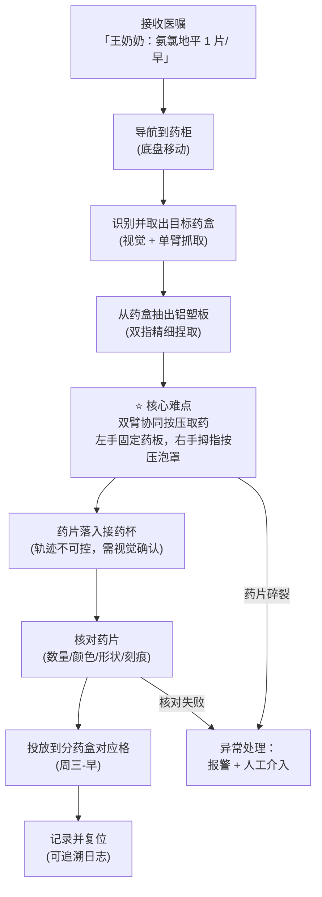

# 任务 A · 自动分药

> **场景**：养老院药房 / 家庭药柜。机器人根据医嘱表，把每位老人的药从原包装（重点：铝塑泡罩板）分装到按"天 × 时段"划分的分药盒/托盘中。

!!! info "任务形态演进（2026-07-17 更新）"
    v0/v1 探索的是"按压取药"（把药片压出泡罩）。结合真实分药流程反馈，主线任务升级为 **v2 撕剪分装**：一板 8 片，沿易撕线撕下包含目标药片的单格（药片保持密封）投入托盘——更卫生、可追溯，也是照护机构的主流做法。**v3 进一步补全闭环**：药板竖插在装有多块铝塑板的盒 A 插板架中，左手真实抓取取出，撕下的单格入盒 B，剩板放回盒 A 原槽位。按压取药保留为力控基本功练习。

## 任务全流程分解

## 核心难点：按压取药的物理学

铝塑板取药看似简单，实际是一个**接触密集、双手协同、力位混合控制**问题：

1. **固定**：一只手（或夹爪）需要稳定夹持药板边缘，不能遮挡目标泡罩；
2. **按压**：另一手指尖对准泡罩中心，垂直施力。力太小铝膜不破，力太大药片碎裂——典型药片的破膜力窗口大约在 5~30 N 之间且随药型变化（后续实测建立数据库）；
3. **突破瞬间**：铝膜破裂瞬间阻力骤降，手指会"冲"出去——需要高带宽力反馈及时刹住（这正是位置控制做不到、必须力控/阻抗控制的原因）；
4. **药片弹出**：药片脱离方向不完全可控，接药杯要放对位置，视觉要确认"确实掉进去了"。

!!! note "启发：人是怎么做的？"
    观察你自己取药：拇指指腹（软组织！）按压，靠触觉感知铝膜破裂，眼睛甚至可以不看。这提示我们：**指尖触觉传感器**和**柔性指腹**可能比高精度视觉更关键。

## 感知需求清单

| 感知能力 | 用途 | 候选方案 |
|---|---|---|
| 药盒/药板检测与姿态估计 | 抓取规划 | RGB-D + 检测/位姿模型 |
| 泡罩定位（哪个格子还有药） | 按压点选择 | 高分辨率手眼相机 |
| 药片识别（种类核对） | 用药安全 | 细粒度分类模型 + 医嘱数据库比对 |
| 接触力感知 | 按压力控 | 关节力矩 + 指尖力/触觉传感器 |
| 药片落杯确认 | 闭环校验 | 俯视相机 / 重量传感器 |

## 安全与合规要点

- **零差错原则**：宁可停机报警，不可分错药。每一格分药完成后拍照留档，形成可追溯记录。
- **交叉污染**：接触药片的部位需可消毒/更换（产品化时考虑一次性接药杯）。
- **人工复核界面**：初期产品定位为"机器分 + 人核对"，逐步建立信任。

## 评价指标（我们将持续追踪）

| 指标 | 定义 | 当前 | 目标 |
|---|---|---|---|
| 单片取药成功率 | 完整取出且药片无损/总尝试 | - | ≥ 99% |
| 药片破损率 | 碎裂或缺角/总取出 | - | ≤ 0.5% |
| 识别核对准确率 | 正确判断药片种类 | - | ≥ 99.9% |
| 单片平均耗时 | 从按压到落杯 | - | ≤ 10 s |

## 阶段性研究计划

- [ ] 收集 10 种常见铝塑板药品，实测破膜力/易撕线撕裂力曲线（需要力传感器，也可先查文献）
- [x] 在 MuJoCo 中建模泡罩 —— 接触力阈值触发破膜方案，见 [2026-07-10 实验 2](../journal/2026-07-10.md#exp2-pill-demo)
- [x] 双臂协同按压全流程仿真验证（v0 压杆 → v1 徒手指尖直压，均 3/3 入杯，见[实验 3](../journal/2026-07-10.md#exp3-pill-v1)）
- [x] **v2 撕剪分装**：8 格板 + 可断裂焊接约束易撕线，双臂撕下单格入托盘 2/2，见 [2026-07-17 (下)](../journal/2026-07-17-tear.md)
- [x] **v3 全闭环**：盒 A（插板架）真实抓取取板 → 撕剪 → 单格入盒 B → 剩板放回盒 A，见 [2026-07-17 (晚)](../journal/2026-07-17-full.md)
- [x] **v4 轮式移动工作站**：双臂 + 盒 A/B 装上差速底盘（平面三关节近似），先导航后操作，见 [2026-07-18](../journal/2026-07-18-mobile.md)
- [ ] 目标格随机化（8 格任选 + 板位姿扰动），测脚本策略鲁棒边界
- [ ] 把 v4 场景改造成 Gymnasium 环境（域随机化 + 奖励设计）
- [ ] 仿真中训练双臂撕剪策略（阶段 3，模仿学习 / RL）
- [ ] 药片视觉识别数据集构建
